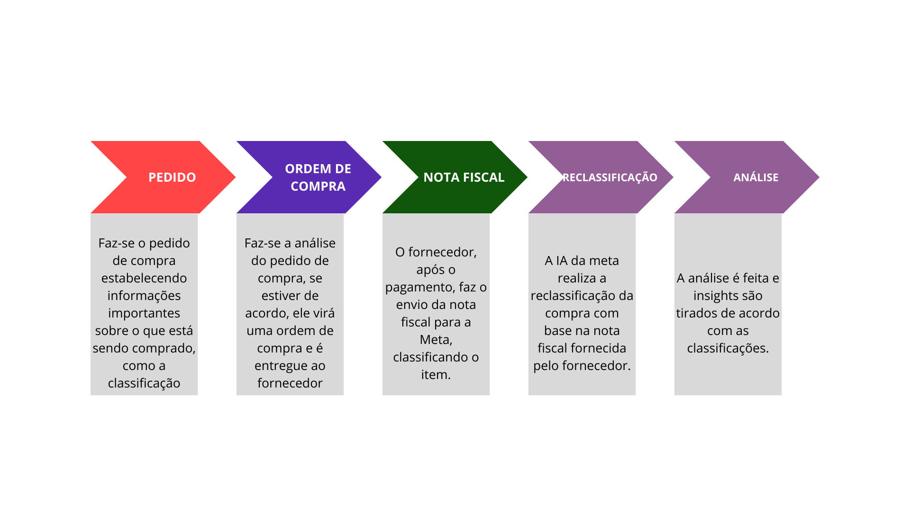
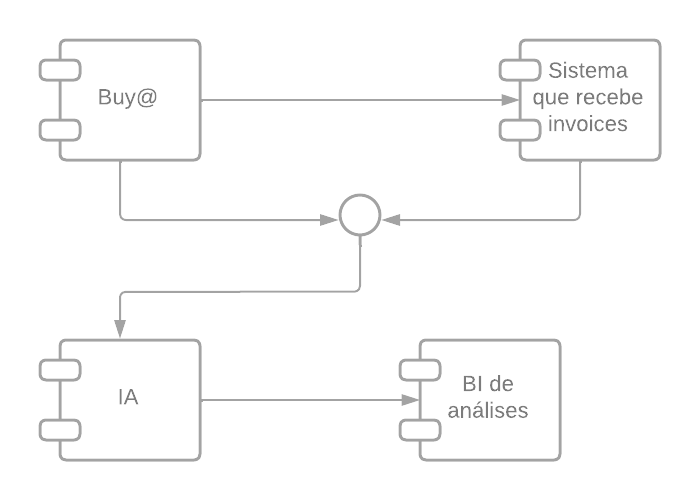
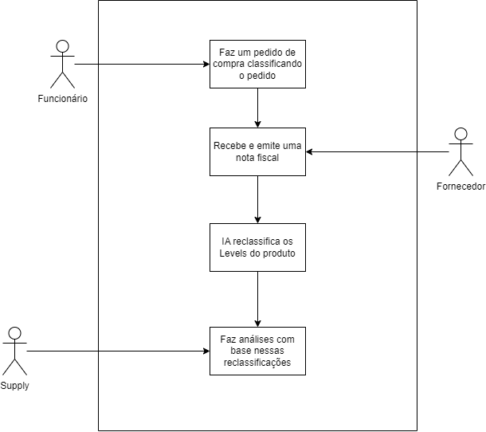
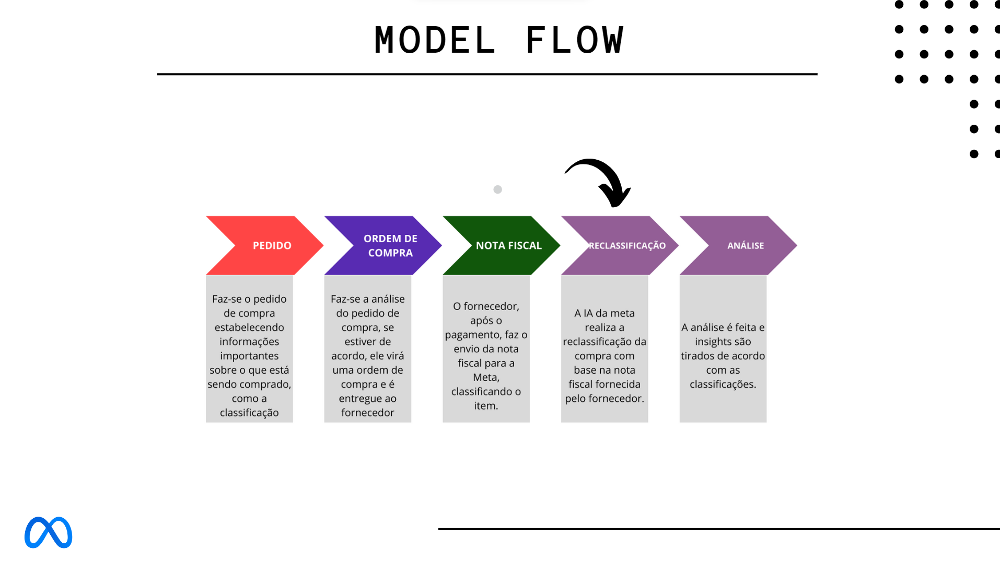

# Projeto de Arquitetura de Software

<p align="center">
<a href= "https://www.inteli.edu.br/"></a>
</p>

**Nome do Projeto:** Projeto de arquitetura de software

**Nome do Parceiro:** Meta

**Nome do Grupo:** Metatesters

**Integrantes do grupo:**

- <a href="https://www.linkedin.com/in/felipesilberberg/">Felipe Silberberg</a>
- <a href="https://www.linkedin.com/in/gabrielriostorres/">Gabriel Rios Torres</a>
- <a href="https://www.linkedin.com/in/raissa-sabino/">Raissa Sabino</a>
- <a href="https://www.linkedin.com/in/mariana-silva-paula/">Mariana Silva de Paula</a>
- <a href="https://www.linkedin.com/in/yveslevi/">Yves Lapa</a>
- <a href="https://www.linkedin.com/in/wagner-estevam/">Wagner Estevam</a>

**Conteúdo**

- [Visão de Negócio](#visao-do-negocio)
- [Especificação de Requisitos](#Especificação-de-Requisitos)
- [Visão Modelo Comportamental](#Visão-Modelo-Comportamental)
- [Avaliação dos mecanismos de engenharia e de tecnologia utilizados no sistema atual](#Avaliação-dos-mecanismos-de-engenharia-e-de-tecnologia-utilizados-no-sistema-atual)
- [Especificação da solução técnica do novo](#Especificação-da-solução-técnica-do-novo)
- [Simulação do Novo, incluindo as táticas e os componentes](#Simulação-do-Novo,-incluindo-as-táticas-e-os-componentes)
- [Modelagem comportamental e simulação do tempo de resposta](#Modelagem-comportamental-e-simulação-do-tempo-de-resposta)
- [Implementação dos Mecanismos Arquiteturais](#Implementação-dos-Mecanismos-Arquiteturais)
- [Testes automatizados, não funcionais](#Testes-automatizados,-não-funcionais)
- [Avaliação dos Resultados e Limites do Sistema](#Avaliação-dos-Resultados-e-Limites-do-Sistema)
- [Revisão do Modelo de Simulação do Novo](#Revisão-do-Modelo-de-Simulação-do-Novo)
- [Estrutura estática do modelo de segurança](#Estrutura-estática-do-modelo-de-segurança)
- [Modelagem comportamental e testes da segurança](#Modelagem-comportamental-e-testes-da-segurança)
- [Simulação das Condições de Exceção](#Simulação-das-Condições-de-Exceção)
- [Simulação das Condições Limites do Sistema com as Melhorias](#Simulação-das-Condições-Limites-do-Sistema-com-as-Melhorias)
- [Ajustes de implementação](#Ajustes-de-implementação)
- [Evidências de testes não funcionais](#Evidências-de-testes-não-funcionais)
- [Análise dos Registros de Testes Automatizados](#Análise-dos-Registros-de-Testes-Automatizados)
- [Medição do novo sistema](#Medição-do-novo-sistema)
- [Avaliação das Medidas](#Avaliação-das-Medidas)
- [Identificação dos tradeoffs arquiteturais](#Identificação-dos-tradeoffs-arquiteturais)
- [Evidência dos Tradeoffs com Base em Medidas Realizadas](#Evidência-dos-Tradeoffs-com-Base-em-Medidas-Realizadas)

# Sprint 1

## Visão de Negócio (Versão 1)

### Sobre a empresa
<p>A empresa Meta é uma gigante da tecnologia que tem uma história rica e influência significativa no mercado e na sociedade. Anteriormente conhecida como Facebook, a empresa passou por uma rebranding e mudou seu nome para Meta em outubro de 2021, refletindo sua nova visão para o futuro.</p>
<p>A história da Meta começou em 2004, quando Mark Zuckerberg e seus colegas de Harvard lançaram o Facebook, uma rede social voltada para conectar estudantes universitários. A plataforma cresceu rapidamente e se expandiu para incluir usuários de todo o mundo. O Facebook revolucionou a forma como as pessoas se comunicam e compartilham informações, tornando-se um dos maiores meios de interação social online.</p>
<p>Além do Facebook, a Meta é proprietária de várias outras empresas e produtos populares, incluindo o Instagram, o WhatsApp e o Oculus VR, que é uma divisão de realidade virtual. Esses produtos têm um impacto massivo na vida das pessoas, moldando a maneira como elas se conectam, compartilham informações e até mesmo como consomem conteúdo de entretenimento.</p>
<p>O alcance da Meta é imenso, com bilhões de usuários em todo o mundo. Essa grandeza se traduz em um impacto substancial na economia e na sociedade. A empresa desempenha um papel significativo na publicidade online, e suas plataformas são essenciais para muitos negócios que desejam alcançar seu público-alvo.</p>
<p>Internamente, a Meta tem um quadro de funcionários de 86,4 mil (dados do final de 2022), além de sua sede na Califórnia - Estados Unidos, a Meta possui escritórios regionais, centros de engenharia e instalações de data centers em vários países, incluindo Reino Unido, Irlanda, Alemanha, Índia, Brasil, Canadá e muitos outros.</p>

### Supply Chain e sua importância
<p>Um setor de extrema importância para o funcionamento da empresa é o de Supply Chain, que desempenha um papel fundamental no processo de aquisição interna de materiais, abrangendo desde matérias-primas para a fabricação de óculos de realidade virtual até mobiliário de escritório. Esta área é encarregada tanto da gestão logística quanto do relacionamento com fornecedores.
Outra função crucial deste setor é a análise dos dados relacionados a essas compras, com o objetivo de identificar oportunidades para ajustar ou eliminar aquisições existentes e avaliar a necessidade de novas compras. No entanto, é importante mencionar que a empresa tem enfrentado desafios na classificação desses dados, o que resultou em uma taxa de precisão de apenas 65% na categorização das compras, tornando a análise mais complexa e sujeita a imprecisões.</p>

<p>Para uma visão mais detalhada do processo de compra, ele é iniciado com a solicitação de compra feita pelo usuário. Nesse momento, ocorre a primeira classificação dos níveis, que, caso aprovado, resulta na emissão de uma ordem de compra. Após, esta é encaminhada ao fornecedor, que, por sua vez, emite uma nota fiscal com novas classificações. É nesse ponto que entra em cena uma Inteligência Artificial responsável por realizar uma reclassificação dessas compras, com o intuito de proporcionar ao profissional de supply as informações necessárias para análises aprofundadas. Para uma visão mais detalhada, visualize o diagrama BPM abaixo.</p>
<br>

### Diagrama BPM:
</img>

Contudo, o grande desafio que tem sido enfrentado reside na precisão das classificações, que se encontram com uma taxa de acerto de apenas 65%. Isso acaba por dificultar as análises e auditorias conduzidas pela equipe de supply. 
<p> Como parte do projeto Inteli, nosso compromisso é elevar essa precisão para um patamar de 95% de confiabilidade, visando aprimorar significativamente a qualidade e eficácia desse processo. </p> 

### Diagrama de Componentes:
Atualmente a solução têm 4 componentes principais.
<li> Buy@: Sistema onde é feito a ordem de compra
<li> Sistema que recebe invoices: ou seja, que recebe as notas fiscais enviadas pelo fornecedor
<li> IA: Inteligência Artificial de clusterização que reclassifica o pedido de compra com base nos dados já recebidos.
<li> BI de análises: Quadro onde são feitas análises estratégias, operacionais e táticas sobre possíveis problemáticas da área de Supply.
</img>


### Diagrama de caso de uso:
<p> Abaixo há o diagrama de caso de uso da solução atual, ela começa com um funcionário que faz um pedido de ordem de compra, classificando a mesma. 
</p>
<p> Após isso, o fornecedor quando recebe a ordem de compra, emite uma nota fiscal, ou invoice, e envia para a Meta.
</p>
<p> Depois, essa ordem de compra é reclassificada com base nos dados disponibilizados pela inteligência artificial da empresa.
</p>
<p> Por fim, o profissional de Supply faz análises com base nessa reclassificação.
</p>

</img>

### Volumetria
A análise de volumetria pode ser encontrada 
<a href="src/app/MetaII.ipynb"> aqui </a>

### Matriz de Riscos

A matriz de risco é uma ferramenta utilizada para avaliar e gerenciar os riscos de um projeto, atividade ou situação. Ela organiza os riscos em categorias e níveis de impacto e probabilidade, permitindo uma análise mais clara e estruturada. Por meio da matriz de risco, é possível identificar os riscos mais significativos e adotar medidas preventivas e corretivas para mitigar seus impactos. Essa ferramenta é essencial para o planejamento e controle de riscos em diversas áreas, contribuindo para a tomada de decisões mais seguras e eficazes.


### Descrição da Simulação do Sistema Atual

A simulação realizada emprega um modelo de escolha randômica e possui o objetivo de analisar o comportamento e desempenho do sistema atual, bem como identificar riscos e pontos de melhoria. Neste contexto, foram utilizadas métricas de probabilidade pré-definidas, sendo 65% de chance do sistema realizar a classificação corretamente e 35% de chance do sistema errar sua categroização.

No contexto do projeto, esta simulação é de suma importância, uma vez que avalia o desempenho do modelo atual e contribui com o processo de aprimoramento do modelo, garantindo melhores resultados para a empresa tanto no âmbito financeiro como também no contábil e de sourcing. 

No código de simulação, a função **`simulacao`** realiza o processo, utilizando as probabilidades evidenciadas no primeiro parágrafo e retorna o resultado para 10.000 categorizações distintas. Após o processo, a simulação é registrada e exibida no final para fins de análise e transparência.

Ao final do código, é feita a exibição do resultado da simulação, tanto no formato de texto corrido (mostrando o resultado para as 10.000 categorizações) como também no formato de porcentagem. Além disso, um gráfico de barras exibe e facilita a compreensão do processo.

Por fim, a partir dos números do teste, conclui-se que a acurácia atual se apresenta como um risco para a empresa, haja vista que a categorização incorreta dos pedidos de compra acarreta em problemas para a atividade estratégica da companhia, além de interferir de forma negativa no controle tributário.


## Especificação de Requisitos (Versão 1)

- Precisão das taxonomias dos itens de compras: O sistema deve ter um aumento da confiabilidade para 95%

No sistema atual, foi identificada uma vulnerabilidade na precisão das taxonomias dos itens de compras. Por exemplo, a falta de validação de dados levou a erros nas classificações, tornando os relatórios e análises imprecisos. Para melhorar a precisão das taxonomias dos itens de compras e aumentar a confiabilidade para 95%, deve-se implementar um sistema de validação e verificação dos dados inseridos. Isso pode ser feito por meio de algoritmos de aprendizado de máquina ou técnicas de processamento de linguagem natural, que podem identificar e corrigir erros ou inconsistências nas taxonomias dos itens de compras. Além disso, deve-se realizar testes regulares para garantir a precisão contínua das taxonomias.

Justificativa de escolha:  Foi escolhido devido ao impacto direto na qualidade das análises de compra, contribuindo para a tomada de decisões mais informadas e redução de erros. Ao eliminar a vulnerabilidade relacionada à precisão, o sistema garantirá que as classificações estejam corretas, facilitando a análise e permitindo decisões mais assertivas. Isso contribuirá para melhorias nas SLAs ao evitar erros na emissão de Nota Fiscal e prevenir transações fraudulentas, alinhando-se com os business drivers da Meta.

- Segurança dos dados compartilhados: O sistema deve garantir que os dados armazenados estejam seguros

Para garantir a segurança dos dados compartilhados, é importante implementar medidas de segurança adequadas. Isso pode incluir a criptografia dos dados durante a transmissão, a implementação de autenticação e autorização robustas, a utilização de protocolos seguros de comunicação e a implementação de políticas de segurança claras. Além disso, é fundamental garantir que o software esteja em conformidade com as regulamentações de proteção de dados aplicáveis e que sejam adotadas práticas de segurança recomendadas, como a realização de testes de penetração e a aplicação de patches de segurança regularmente .

Justificativa de escolha: Este requisito foi destacado porque a integridade e privacidade dos dados compartilhados são vitais para manter a confiança dos clientes e evitar violações de dados. Ao garantir a segurança dos dados compartilhados, o sistema protegerá a integridade e privacidade dos dados, evitando riscos de violações e mantendo a confiança dos clientes. Isso se alinha com o objetivo de prevenir transações fraudulentas e melhorar a disponibilidade do sistema.

- Desempenho: O sistema deve ter um tempo de resposta inferior a 30 segundos para acessos, consultas e transações de fluxo

Para melhorar o desempenho do software e garantir um tempo de resposta inferior a 30 segundos para acessos, consultas e transações de fluxo, é recomendado otimizar o código e a arquitetura do sistema. Para tal, pode-se  utilizar técnicas de cache, otimização de consultas de banco de dados, implementação de algoritmos eficientes e a utilização de servidores de alto desempenho. Ademais, é importante realizar testes de carga e monitorar o desempenho do sistema para identificar possíveis gargalos e realizar ajustes necessários.

Justificativa de escolha: O desempenho é um requisito crítico, uma vez que o tempo de resposta rápido é essencial para atender às demandas de usuários e manter a eficiência das operações. Garantir que o sistema responda em menos de 30 segundos é crucial para manter a produtividade e a satisfação dos usuários. Além disso, um desempenho otimizado está alinhado com a busca por melhorias na disponibilidade do sistema, um dos business drivers identificados.


- Tolerância a falhas:  O sistema deve ter ferramentas para lidar com resiliência diante de falhas na infraestrutura e nas operações inconsistentes

Sobre a tolerância a falhas do software, é recomendado implementar ferramentas e mecanismos que possam lidar com resiliência diante de falhas na infraestrutura e nas operações inconsistentes. Isso pode incluir a implementação de redundância de servidores, a utilização de técnicas de balanceamento de carga, a realização de backups regulares dos dados e a implementação de mecanismos de recuperação de falhas. Ainda nesse ponto, é importante realizar testes de estresse e simulações de falhas para identificar possíveis pontos fracos e garantir a resiliência do sistema.

Justificativa de escolha: A tolerância a falhas é um requisito crítico porque garante que o sistema possa manter sua operação contínua, mesmo em situações de falha na infraestrutura ou operações inconsistentes. Isso é vital para manter a disponibilidade e confiabilidade do sistema, especialmente em um ambiente de supply chain onde a interrupção pode resultar em sérios impactos nos negócios. Além disso, melhorar a tolerância a falhas também está alinhado com o aumento da disponibilidade do sistema, um dos business drivers identificados.


- Rastreabilidade: O sistema deve permitir o rastreamento e o armazenamento de dados imputados manualmente e automaticamente

Para garantir a rastreabilidade dos dados imputados manualmente e automaticamente, é recomendado implementar um sistema de registro e armazenamento adequado. Uma alternativa é por meio por meio de um banco de dados seguro, onde todas as informações inseridas manualmente ou geradas automaticamente são registradas e armazenadas de forma rastreável. Outrossim, é importante implementar mecanismos de controle de acesso e auditoria para garantir a integridade e a segurança dos dados rastreados.

Justificativa de escolha: A rastreabilidade é um requisito crítico, pois permite um acompanhamento completo das ações e operações realizadas no sistema. Isso é fundamental para a auditoria, conformidade com regulamentações e identificação de possíveis erros ou anomalias. A capacidade de rastrear e armazenar dados é uma resposta direta ao risco de erros na classificação de dados advindos da Nota Fiscal, riscos de erros não resolvidos e a falta de evidência de transações com falhas identificados na Matriz de Risco. Além disso, isso pode contribuir para a prevenção de transações fraudulentas, que é um dos principais business drivers identificados.


- Segurança: O sistema deve garantir a integridade, privacidade e accountability dos dados

Uma outra vulnerabilidade está relacionada à segurança, onde dados não estão adequadamente criptografados, o que coloca em risco a integridade e a privacidade das informações. Por tais motivos, é válido implementar medidas de segurança que abordem a integridade, privacidade e accountability dos dados. Tal requisito pode ser feito com a criptografia dos dados armazenados, a implementação de controles de acesso baseados em funções, a realização de auditorias regulares para detectar possíveis violações de segurança e a adoção de políticas de privacidade claras e transparentes. Além disso, é fundamental garantir que o software esteja em conformidade com as regulamentações de proteção de dados aplicáveis.

## Visão Modelo Comportamental (Simulação)

### Descrição da Simulação do Sistema Novo

A simulação realizada emprega um modelo de Cadeia de Markov para prospectar o comportamento da reformulação de um sistema de reclassificação de rótulos de compras, o qual está em fase de planejamento para futura implementação no sistema de compras da Meta. O modelo de Cadeia de Markov, uma ferramenta estatística robusta, é utilizado para estimar as probabilidades de transição entre diferentes estados, fundamentando-se no princípio de que a transição para um novo estado é influenciada unicamente pelo estado presente, independente da sequência de estados antecedentes.

No contexto desta simulação, os estados representam a classificação de uma compra como "Correto" ou "Incorreto" pelo novo sistema. O modelo foi configurado com uma matriz de transição que reflete a probabilidade de 85% de uma compra ser corretamente classificada (estado "Correto") e 15% de chance de ser incorretamente classificada (estado "Incorreto"). Além disso, se uma compra é inicialmente classificada incorretamente, há 15% de chance de ser corrigida na próxima classificação, enquanto há 85% de chance de permanecer incorreta.
	
A função **`forecast`** realiza a simulação, gerando uma sequência de classificações de compras com base nas probabilidades estabelecidas na matriz de transição. A função registra cada estado resultante e a probabilidade acumulada da sequência de estados gerada.

Ao final da simulação, a distribuição dos estados "Correto" e "Incorreto" é visualizada por meio de um gráfico de barras, facilitando a avaliação do desempenho do sistema. O resultado esperado é que aproximadamente 85% das classificações estejam corretas, refletindo a precisão configurada para o sistema.

Essa simulação serve como uma ferramenta valiosa para avaliar e ajustar o desempenho do novo sistema de reclassificação de rótulos, garantindo assim a eficácia e a confiabilidade nas operações de compra.


# Sprint 2 

## Avaliação dos mecanismos de engenharia e de tecnologia utilizados no sistema atual

### Revisão do mapa de requisitos não funcionais e respectivas vulnerabilidades

**Precisão das taxonomias dos itens de compras**: O sistema deve ter um aumento da confiabilidade para 95%
No sistema atual, foi identificada uma vulnerabilidade na precisão das taxonomias dos itens de compras. Por exemplo, a falta de validação de dados levou a erros nas classificações, tornando os relatórios e análises imprecisos. Para melhorar a precisão das taxonomias dos itens de compras e aumentar a confiabilidade para 95%, deve-se implementar um sistema de validação e verificação dos dados inseridos. Isso pode ser feito por meio de algoritmos de aprendizado de máquina ou técnicas de processamento de linguagem natural, que podem identificar e corrigir erros ou inconsistências nas taxonomias dos itens de compras. Além disso, deve-se realizar testes regulares para garantir a precisão contínua das taxonomias.

**Entrada**: Sistema com validação insuficiente, acurácia presumida de 65%.

**Abordagem de controle**: Medir essas validações do modelo através de um teste de curadoria, onde garantimos que 100% das respostas colocadas pelo humano foram corretas e assim, medimos de forma matemática a acurácia do modelo.

**Saída**: Sistema com validações medidas de forma exata. 

<br>

**Segurança dos dados compartilhados**: O sistema deve garantir que os dados armazenados estejam seguros
Para garantir a segurança dos dados compartilhados, é importante implementar medidas de segurança adequadas. Isso pode incluir a criptografia dos dados durante a transmissão, a implementação de autenticação e autorização robustas, a utilização de protocolos seguros de comunicação e a implementação de políticas de segurança claras. Além disso, é fundamental garantir que o software esteja em conformidade com as regulamentações de proteção de dados aplicáveis e que sejam adotadas práticas de segurança recomendadas, como a realização de testes de penetração e a aplicação de patches de segurança regularmente .

**Entrada**: Sistema com vulnerabilidades de segurança no tráfego dos dados.

**Abordagem de controle**: Testes de carga e vulnerabilidade para identificar e mitigar falhas de segurança.

**Saída**: Sistema fortalecido com testes de segurança frequentes.

<br>

**Desempenho**: O sistema deve ter um tempo de resposta inferior a 30 segundos para acessos, consultas e transações de fluxo
Para melhorar o desempenho do software e garantir um tempo de resposta inferior a 30 segundos para acessos, consultas e transações de fluxo, é recomendado otimizar o código e a arquitetura do sistema. Para tal, pode-se utilizar técnicas de cache, otimização de consultas de banco de dados, implementação de algoritmos eficientes e a utilização de servidores de alto desempenho. Ademais, é importante realizar testes de carga e monitorar o desempenho do sistema para identificar possíveis gargalos e realizar ajustes necessários.

**Entrada**: Supostamente, o sistema demora um tempo superior a 30 segundos para realizar consultas.

**Abordagem de controle**: Realizar simulações, como no JMT, para testar o desempenho do sistema, além de usar logs para medir o tempo de resposta

**Saída**: As Simulações servem para entender o padrão do sistema e os logs dão uma noção do desempenho do sistema atualmente.

<br>

**Disponibilidade**: O sistema deve ter ferramentas para lidar com resiliência diante de falhas na infraestrutura e nas operações inconsistentes
Sobre a tolerância a falhas do software, é recomendado implementar ferramentas e mecanismos que possam lidar com resiliência diante de falhas na infraestrutura e nas operações inconsistentes. Isso pode incluir a implementação de redundância de servidores, a utilização de técnicas de balanceamento de carga, a realização de backups regulares dos dados e a implementação de mecanismos de recuperação de falhas. Ainda nesse ponto, é importante realizar testes de estresse e simulações de falhas para identificar possíveis pontos fracos e garantir a resiliência do sistema.

**Entrada**:  Supostamente, o sistema caí com uma frequência inferior a 99%

**Abordagem de controle**: Para controle, podemos usar métricas como tempo médio entre falhas (MTBF), o tempo médio de reparo (MTTR) para analisar o sistema.

**Saída**: Disponibilidade do sistema monitorada com base em porcentagem e métricas.

<br>

**Rastreabilidade**: O sistema deve permitir o rastreamento e o armazenamento de dados imputados manualmente e automaticamente
Para garantir a rastreabilidade dos dados imputados manualmente e automaticamente, é recomendado implementar um sistema de registro e armazenamento adequado. Uma alternativa é por meio por meio de um banco de dados seguro, onde todas as informações inseridas manualmente ou geradas automaticamente são registradas e armazenadas de forma rastreável. Outrossim, é importante implementar mecanismos de controle de acesso e auditoria para garantir a integridade e a segurança dos dados rastreados.

**Entrada**: Ausência de um sistema de rastreabilidade eficiente para dados imputados manual e automaticamente.

**Abordagem de controle**: Implementar registros detalhados de todas as interações e transações no sistema, com carimbos de data e hora, permitindo uma trilha de auditoria completa. Além disso, estabelecer políticas de controle de acesso para garantir que apenas usuários autorizados possam visualizar ou modificar esses registros.

**Saída**: Sistema com capacidade robusta de rastreamento, permitindo a identificação precisa de quem inseriu ou modificou dados, quando e por quê.

<br>

**Segurança**: O sistema deve garantir a integridade, privacidade e accountability dos dados.
Uma outra vulnerabilidade está relacionada à segurança, onde dados não estão adequadamente criptografados, o que coloca em risco a integridade e a privacidade das informações. Por tais motivos, é válido implementar medidas de segurança que abordem a integridade, privacidade e accountability dos dados. Tal requisito pode ser feito com a criptografia dos dados armazenados, a implementação de controles de acesso baseados em funções, a realização de auditorias regulares para detectar possíveis violações de segurança e a adoção de políticas de privacidade claras e transparentes. Além disso, é fundamental garantir que o software esteja em conformidade com as regulamentações de proteção de dados aplicáveis.
</p>

**Entrada**: Dados não estão adequadamente criptografados, colocando em risco a integridade e privacidade das informações.

**Abordagem de controle**: Implementar algoritmos robustos de criptografia para proteger os dados armazenados e transmitidos. Estabelecer políticas de controle de acesso baseadas em funções, garantindo que apenas usuários autorizados tenham acesso a informações sensíveis. Realizar auditorias regulares para identificar e corrigir possíveis lacunas de segurança.

**Saída**: Sistema com dados devidamente criptografados, acesso controlado e auditorias periódicas para manter a segurança e a privacidade dos dados.

### Táticas arquiteturais e componentes adotados que ajudam a execução e o controle do RNF do sistema atual

<br>

RNF 1 -  Precisão das taxonomias dos itens de compras: O sistema deve ter um aumento da confiabilidade para 95%

Estratégia arquitetural e componentes:
 
- Utilização de algoritmos de aprendizado de máquina e modelagem preditiva para aprimorar a classificação automática de itens

Monitoramento:
	
- Monitoramento contínuo da precisão das taxonomias com métricas de acurácia 

Resolução e Recuperação:

- Revisão automática das classificações incorretas após a detecção de baixa confiabilidade.

- Implementação de workflows para a revisão humana e reclassificação dos itens.

<br>

RNF 2 -  Segurança dos dados compartilhados: O sistema deve garantir que os dados armazenados estejam seguros

Estratégia arquitetural e componentes:

- Utilização de serviços de criptografia e acesso controlado aos dados sensíveis.

- Implementação de políticas de segurança detalhadas, utilizando IAM (Identity and Access Management) da AWS.

Monitoramento:

- Monitoramento constante de acessos não autorizados e tentativas de violação de segurança.

Resolução e Recuperação:

- Uso de backups automáticos e replicação de dados críticos para recuperação em caso de violação.

<br>

RNF 3 - Desempenho: O sistema deve ter um tempo de resposta inferior a 30 segundos para acessos, consultas e transações de fluxo

Estratégia arquitetural e componentes:

- Utilização de serviços baseados em nuvem da AWS para escalabilidade e distribuição de carga.

Monitoramento:

- Monitoramento do tempo de resposta das consultas e transações.

Resolução e Recuperação:

- Escalabilidade automática conforme a demanda, expandindo recursos em picos de tráfego.

<br>

RNF 4 -  Tolerância a falhas/Disponibilidade: O sistema deve ter ferramentas para lidar com resiliência diante de falhas na infraestrutura e nas operações inconsistentes

Estratégia arquitetural e componentes:

- Utilização de serviços de infraestrutura resiliente da AWS, como Amazon S3 e Elastic Load Balancing 

- Utilização ferramentas de monitoramento de infraestrutura, como o Amazon CloudWatch, que permite monitorar métricas de desempenho e disponibilidade dos recursos da AWS. Além disso, pode-se configurar alertas para serem acionados quando a disponibilidade do sistema estiver abaixo do esperado.

Monitoramento:

- Monitoramento contínuo da integridade dos serviços e recursos da AWS

Resolução e Recuperação:

- Automatização de processos de recuperação de falhas, incluindo failover e redundância de sistemas.

- Implementação de práticas de alta disponibilidade, como a utilização de serviços de balanceamento de carga, como o Elastic Load Balancer da AWS, para distribuir o tráfego entre instâncias do sistema e garantir a disponibilidade contínua.

<br>

RNF 5 - Rastreabilidade: O sistema deve permitir o rastreamento e o armazenamento de dados imputados manualmente e automaticamente

Estratégia arquitetural e componentes:

- Implementação de registro detalhado de todas as operações inseridas no sistema.

Monitoramento:

- Monitoramento contínuo da integridade e completude dos logs de rastreabilidade.

Resolução e Recuperação:

- Uso de backups e replicação de logs para garantir a disponibilidade e recuperação dos dados de rastreabilidade.

<br>

RNF 6 -  Segurança: O sistema deve garantir a integridade, privacidade e accountability dos dados

Estratégia arquitetural e componentes:

- Utilização de práticas de segurança em todas as camadas da aplicação, incluindo serviços da AWS com recursos avançados de segurança.

Monitoramento:

- Monitoramento contínuo de vulnerabilidades e tentativas de acesso indevido.

Resolução e Recuperação:

- Ativação de medidas de contingência em caso de violação de segurança, como isolamento de recursos comprometidos e revisão das políticas de segurança.

## Especificação da solução técnica do novo

###  Revisão do mapa de requisitos não funcionais do novo cujas vulnerabilidades e defeitos serão eliminados

- Para o requisito não funcional de disponibilidade, sua **entrada** se refere a disponibilidade do sistema baseada na monitoração de porcentagens e métricas, sua **saída** será uma disponibilidade de 95% do tempo, com desvio padrão por volta de 3%, isso será mensurado a partir do seu **controle**, que se dará a partir do deploy na AWS ou cloud semelhante, tendo sua disponibilidade atribuída a queda de um EC2, que, historicamente, é muito baixa, batendo a disponibilidade requerida pelo nosso sistema novo.

- Para o requisito não funcional de tempo de resposta sua **entrada** se refere às simulações, que permitem compreender o padrão do sistema, aliadas aos registros/logs, sua **saída** será a implementação de memória cache para a conversão mais rápida de respostas a pesquisas mais recorrentes na base de dados, o **controle** deste requisito poderá ser feito com a introdução de um sistema de metrificação de queries, contabilizando aquelas mais repetidas.
  
- Para o requisito não funcional de segurança sua **entrada** se referem aos testes já existentes, enquanto sua **saída** deverá ser o controle de acesso por parte dos introdutores de conteúdos na base de dados, ou seja, seu **controle** se dará por intermédio de um sistema de login/validação do usuário que está fazendo o requerimento da compra, a partir de uma curadoria com humanos que já são funcionários e podem utilizar da sua experiência para ajudar na classificação primária das compras, tornando o sistema mais seguro como um todo.


### Táticas arquiteturais e componentes adotadas que ajudam a execução e o controle do RNF do sistema novo

**Requisito de disponibilidade**

- A tática arquitetural utilizada para monitorar o requisito de disponibilidade será a adoção de sistemas de monitoramento, que irão verificar continuamente o estado de disponibilidade do sistema observando as oscilações, utilizando ferramentas de monitoramento e identificando falhas. Para resolver o requisito de disponibilidade iremos adotar redundâncias na arquitetura, onde caso ocorra falha em algum elemento o tráfego recebido por ele seja redirecionado, utilizando por exemplo balanceadores de carga, circuit breakers, orquestradores de escalabilidade horizontal e de containers. Caso seja necessário, a recuperação de impactos será feita através de uma estratégia de backups das partes críticas e armazenamento.

**Requisito de Desempenho**

- A implementação deste requisito na arquitetura será feita incluindo métricas de tempo de resposta em todo o sistema para avaliar o desempenho, para isso utilizaremos ferramentas de monitoramento para coletar dados precisos sobre os tempos de resposta, incluindo webhooks que notifiquem se os tempos de resposta ultrapassarem os limites especificados. A resolução do requisito de disponibilidade na arquitetura será realizada utilizando cachês dos dados que estão sendo acessados de forma frequente, permitindo que caso o tempo de resposta seja maior que o esperado esses dados armazenados em cache sejam utilizados, aumento do hardware e uma estrutura de dados eficientes também serão utilizados de forma preventiva já que as duas táticas melhoram o tempo de resposta.

**Requisito de Segurança**

- Para garantir o controle desse RFN as táticas consideradas são a autenticação de usuários e controle de acesso administrando melhor quem tem acesso aos dados contidos na aplicação assim poderemos monitorar e rastrear atividades suspeitas como acessos não autorizados ou múltiplas tentativas de acesso sem sucesso. Para resolver o requisito de segurança de forma preventiva e reativa realizaremos testes de penetração para encontrar as vulnerabilidades e corrigi-las também iremos implementar a criptografia dos dados para casos de invasão na barreira de autenticação. Em casos de recuperação e subsídio do tratamento dos impactos e quebra de serviço manteremos backups dos dados armazenados em locais diferentes da aplicação e iremos adotar planos de contingência de danos para lidar com a quebra de serviços.

## Simulação do Novo, incluindo as táticas e os componentes

## Estrutura estática do modelo do tempo de resposta

### Listagem de elementos (módulos, componentes, serviços) envolvidos para a simulação da disponibilidade do sistema atual

Os elementos envolvidos para a simulação são:

**Bibliotecas necessárias**
```
const express = require('express');
const CircuitBreaker = require('opossum');
```

**Módulo de Circuit Breaker**

```
const circuit = new CircuitBreaker(simulation, {
  timeout: 1000,
  resetTimeout: 5000,
});
```

**Módulo de Simulação**
```
function simulation() {
  // Simule uma categorização correta ou incorreta
  const categorization = Math.random(); // 80% de chance de ser correta

  if (categorization > 0.65) {
    // Retorna um valor específico para indicar falha
    return 'Falha na categorização';
  } else {
    return 'Categorização correta';
  }
}
```
**API para conectar o Circuit Breaker à simulalação**
```
app.get('/sua-rota', async (req, res) => {
  try {
    const result = await circuit.fire();

    if (result === 'Categorização correta') {
      consecutiveFailures = 0; // Resetar contador de falhas em caso de sucesso
      return res.status(200).json({ message: result });
    } else {
      consecutiveFailures++;
      if (consecutiveFailures >= maxConsecutiveFailures) {
        circuit.open();
      }
      return res.status(500).json({ error: 'Categorização incorreta' });
    }
  } catch (error) {
    if (circuit.status === 'open') {
      return res.status(503).json({ error: 'Circuito aberto' });
    } else {
      return res.status(500).json({ error: 'Erro interno' });
    }
  }
});
```

### Descrição de premissas envolvidas para a simulação da disponibilidade do sistema atual

 * O modelo adota a premissa de que o número de requisições afeta a disponibilidade do sistema. Dessa forma, quanto mais requisições simultâneas, maior vai ser a chance de falha. Por isso, foi estipulado um limite de três classificações taxonômicas incorretas em sequência, evitando assim a sobrecarga de chamadas desnecessárias para a API.

 * O modelo também adota a premissa de que o circuito do sistema deve ter um timeout de 5 segundos, ou seja, ele permanecerá aberto durante 5000ms antes de ir para o estado meio-aberto. Dessa forma, durante esse período, nenhuma requisição será bem-sucedida, contribuindo, assim, com a manutenção da API.

### Justificativa das premissas envolvidas para a simulação da disponibilidade do sistema atual

* A técnica do semáforo é utilizada com o intuito de controlar a carga de requisições que o sistema recebe, impedindo sua sobrecarga e garantindo sua disponibilidade.

* O timeout de 5 segundos foi estipulado, pois acredita-se que seja tempo suficiente para o sistema se recuperar, sem causar maiores prejuízos.

### Descrição de hipóteses consideradas para a simulação da disponibilidade das melhorias do sistema novo
* O modelo está feito a partir da ideia de que a quantidade de requisições afeta sua disponibilidade. E ao projetar a simulação do sistema novo é necessário se atentar as melhorias necessárias, por conta disso foi estipulado que depois de três requisições com erro o sistema fecha por 5 segundos para que não ocorra erro em mais requisições. E espera de que o sistema estabilize nesse período, e ele retorna para o meio aberto e fecha novamente em caso de erro ou abre novamente no caso de requisição correta. 
* O sistema está sendo projetado para ser resiliente a falhas, com mecanismos como redundância e recuperação rápida de falhas.
* O sistema também está sendo projetado também para ser totalmente compatível com as tecnologias atualmente utilizadas para que não seja um problema sua implementação dentro do sistema atual

### Listagem de elementos (módulos, componentes, serviços) envolvidos para a simulação da disponibilidade do sistema novo
Os elementos envolvidos para a simulação do sistema novo são:

**Bibliotecas necessárias**
```
node
const express = require('express');
const CircuitBreaker = require('opossum');

python
import numpy as np
import random as rm
import matplotlib.pyplot as plt
from flask_ngrok import run_with_ngrok
```

**Módulo de Circuit Breaker**
```
const circuit = new CircuitBreaker(simulation, {
  timeout: 1000,
  resetTimeout: 5000,
});
```

**Módulo de Simulação**
```
# Função que implementa o modelo de Markov para prever o estado
def forecast(purchase):
    # Escolha o estado inicial
    currentStatus = "Correto"
    print("Estado inicial: " + currentStatus)

    # Armazene a sequência de estados
    statusSequence = [currentStatus]
    prob_sequence = []

    i = 0
    prob = 1

    while i != purchase:
        if currentStatus == "Correto":
            change = np.random.choice(transitionName[0], replace=True, p=transitionMatrix[0])
            if change == "CC":
                prob = prob * 0.85
                statusSequence.append("Correto")
            else:
                prob = prob * 0.15
                currentStatus = "Incorreto"
                statusSequence.append("Incorreto")
        elif currentStatus == "Incorreto":
            change = np.random.choice(transitionName[1], replace=True, p=transitionMatrix[1])
            if change == "II":
                prob = prob * 0.15
                statusSequence.append("Incorreto")
            else:
                prob = prob * 0.85
                currentStatus = "Correto"
                statusSequence.append("Correto")

        prob_sequence.append(prob)
        i += 1

    print("Possíveis estados: " + str(statusSequence))
    print("Probabilidade da sequência de estados: " + str(prob))

    return statusSequence, prob_sequence

# Função para prever o estado possível nas próximas compras
sequencia_estados, probabilidades = forecast(100)`
```

**API para conectar o Circuit Breaker à simulalação**
```
async function requestToThirdPartyAPI() {
    const response = await axios.post('http://rota/simulate', { purchase: 1000 });
    return response.data;
  }

// Rota para fazer uma requisição à sua API terceira com circuit breaker
app.get('/simulate', async (req, res) => {
  try {
    const result = await circuit.fire();

    if (result === 'Categorização correta') {
      consecutiveFailures = 0; // Resetar contador de falhas em caso de sucesso
      return res.status(200).json({ message: result });
    } else {
      consecutiveFailures++;
      if (consecutiveFailures >= maxConsecutiveFailures) {
        circuit.open();
      }
      return res.status(500).json({ error: 'Categorização incorreta' });
    }
  } catch (error) {
    if (circuit.status === 'open') {
      return res.status(503).json({ error: 'Circuito aberto' });
    } else {
      return res.status(500).json({ error: 'Erro interno' });
    }
  }
});
```

### Descrição de premissas envolvidas para a simulação da disponibilidade do sistema novo
* O sistema implementa um mecanismo de semáforo para regular o fluxo de requisições, evitando sobrecargas. Este mecanismo limita o número de requisições simultâneas, colocando as excedentes em uma fila de espera.
* O sistema mantém um tempo limite (timeout) de 5 segundos para as requisições. Se uma requisição não for completada neste intervalo, ela é abortada.
* As atualizações e manutenções são planejadas para serem executadas com o mínimo impacto possível na disponibilidade do sistema.
  
### Justificativa das premissas envolvidas para a simulação da disponibilidade do sistema novo
*Esta técnica ajuda a manter a estabilidade do sistema, prevenindo falhas devido a picos de demanda. Ao controlar o acesso concorrente aos recursos, o sistema pode operar de forma mais eficiente e confiável.
*Este tempo é considerado suficiente para a maioria das operações, equilibrando a necessidade de resposta rápida com a capacidade do sistema de processar requisições sem se sobrecarregar. Isso ajuda a evitar que requisições pendentes acumulem e sobrecarreguem o sistema.
*Isso é crucial para manter a confiabilidade e a confiança dos usuários, especialmente em sistemas críticos onde a disponibilidade contínua é essencial.


## Modelagem comportamental e simulação do tempo de resposta

### Análise e discussão textual de resultados obtidos com a simulação do sistema atual

A análise dos resultados da simulação do sistema atual se mostrou essencial e possibilitou a identificação de diversos insights, pontos de melhoria e observações necessárias para o prosseguimento e aprimoramento da solução. Nesse cenário, ficou explícito que a API é processada e chamada de maneira eficiente, uma vez que apresentou tempo médio de resposta de 0.2 ms. Ademais, é notória a influência positiva da técnica do semáforo, haja vista que, dessa forma, o controle sobre a carga de requisições é facilitado, além de impedir uma sobrecarga desse sistema. No entanto, a definição do tempo de timeout e o limite de categorizações incorretas em sequência ainda são pontos a serem melhor estudados, a fim de otimizar e minimizar danos e outras consequências negativas.

### Análise e discussão textual de resultados obtidos com a simulação do sistema novo
A simulação do novo sistema foi iniciada com base na análise detalhada dos pontos de melhoria e insights obtidos da simulação do sistema atual. O processo começa com o envio de uma requisição pelo usuário, que é inicialmente processada pelo sistema de circuit breaker. Após passar por essa etapa, a requisição alcança a simulação, que determina se o resultado é "correto" ou "incorreto".

No caso de um resultado "correto", a requisição prossegue normalmente, permitindo a continuidade do fluxo de requisições. Por outro lado, se o resultado for "incorreto", o sistema entra em um estado "meio aberto". Nesse estado, uma nova requisição é permitida para passar. Se esta for bem-sucedida, o sistema retorna ao estado "fechado"; caso contrário, após três falhas consecutivas, o sistema entra em estado "aberto" por 5 segundos. Após esse período, ele retorna ao estado "meio aberto" e o ciclo se repete.

Os resultados obtidos após a simulação foram extremamente positivos. O sistema funcionou conforme esperado, realizando as aberturas e fechamentos necessários em resposta às condições de operação. Isso assegurou o bom funcionamento do sistema, mantendo sua disponibilidade e performance em níveis ótimos.

### Análise e discussão textual das hipóteses a partir da comparação dos resultados de simulação do sistema atual e do sistema novo
As simulações realizadas apresentaram resultados positivos, alinhando-se com as expectativas projetadas para cada uma delas. O sistema de circuit breaker operou de maneira eficaz em ambos os casos, alternando entre os estados "aberto", "meio aberto" e "fechado" conforme as respostas "correto" e "incorreto" obtidas nas simulações. Notavelmente, a precisão do sistema atual atingiu cerca de 65%, enquanto o sistema novo alcançou a eficácia projetada de 85%, demonstrando uma melhoria significativa em relação ao modelo anterior.

### Justificativas das melhorias arquiteturais propostas a partir dos resultados da simulação
As melhorias arquiteturais propostas para o novo sistema foram fundamentadas nos resultados obtidos nas simulações, refletindo um planejamento estratégico e uma análise detalhada das necessidades operacionais. A implementação do sistema de circuit breaker demonstrou ser uma decisão acertada, gerenciando eficientemente o fluxo de requisições e mantendo a estabilidade do sistema em diferentes cenários. A alternância entre os estados "aberto", "meio aberto" e "fechado", em resposta às validações de "correto" e "incorreto", mostrou-se crucial para prevenir sobrecargas e garantir a disponibilidade contínua do sistema.

Além disso, a melhoria significativa na precisão, de 65% no sistema atual para 85% no novo sistema, evidencia o sucesso das inovações implementadas. Essa evolução na precisão não apenas aumenta a confiabilidade do sistema, mas também otimiza a experiência do usuário final. As simulações serviram como um campo de teste vital para essas mudanças, permitindo ajustes finos e garantindo que as melhorias propostas fossem não apenas teóricas, mas efetivamente aplicáveis e benéficas no ambiente real de operação.

Portanto, as justificativas para as melhorias arquiteturais são embasadas tanto na eficiência operacional demonstrada quanto na capacidade de adaptação e resposta do sistema às variadas condições, assegurando um desempenho robusto e confiável.

# Sprint 3 

## Implementação dos Mecanismos Arquiteturais

### Especificação e Codificação dos Testes Não Funcionais dos Componentes (TDD)

- Para a automatização do processo de entrada de uma maior quantidade de dados na base, pode-se verificar a utilização do FastAPI com a intersecção de recursos do próprio python que permitem a listagem e aderência de novos elementos à base de dados de forma automática, com auxílio da biblioteca locust, que gera gráficos e nos traz entendimento sobre falhas nas requisições, tempos de resposta e número de usuários na aplicação, fazendo desde o spike test quanto o load testing. 

### Detalhamento claro de como serão executados os testes, incluindo parâmetros de entrada e saídas

- Em relação aos testes de tempo de resposta, seu parâmetro de entrada é uma base de dados pré-definida de teste com tamanhos crescentes de dados crescendo a uma taxa de 33 dados por segundo, o que, na normalidade tende a ser 2 por segundo, ou seja, uma injeção de dados, enquanto a saída é o desempenho em função do tamanho da base de dados, com o passo a passo sendo desde a entrada massiva de dados por meio de uma simulação de registro de diversas compras de forma não comum para observar como o software responde, essa inserção de dados será metrificada por intermédio da de requisições, com cada requisição representando um novo dado (POST), com o auxílio de programas como o Locust, e registro dessa entrada, com uma amostragem do tempo para execução e consumo de recursos, fazendo uma média anterior ao início do processo e calculando uma distribuição normal para um nível de confiança de 95%, assumindo que o tempo de resposta deve ser no máximo até 3 desvios padrão acima da média, mesmo com a inserção massiva de dados, para o futuro de uma arquitetura nova, pode-se colocar travas com webhooks de alertas para a melhor compreensão por parte do time de negócios sobre uma entrada anormal de dados.

### Definição de cenários de teste e critérios de aceitação.

- A título de simplificação podem ser elencados 2 cenários, um caso de sucesso e um de falha. Para o primeiro caso, temos uma taxonomia classificada dentro de um tempo de resposta aceitável, especificada no tópico anterior, mesmo com um aumento na quantidade de requisições realizadas, enquanto num processo de falha, há uma lentidão na resposta que resulta em timeout da operação.

- Especificando um pouco mais os critérios de aceitação, temos: montantes entre 35000 e 50000 dólares como trava, caso contrário, pode-se estabelecer um webhook conectando o serviço com alguma api de alerta para o time de negócios averiguar a situação e um critério mais relacionado a resposta em si é que a taxa de inserção de dados deverá se manter na normalidade de pelo menos 2 por segundo em períodos regulares.

- No caso em que há uma entrada maior de dados, podem ser colocados na arquitetura nova webhooks que se comuniquem, por meio de chatbot ou integração com alguma API interna da Meta, ao time que está diretamente ligado ao abastecimento de estoques e gestão de compras, mostrando em que região essa entrada está ocorrendo ou se está havendo alguma fraude, podendo ser deixados logs de quem ta inserindo, o que ta comprando, entre outras informações dadas na tabela.

### Implementação dos testes

../Grupo-06/Atual/src/app.py
Acompanhar a implementação do código em, rodar em um terminal: uvicorn app:app --reload

../Grupo-06/Atual/src/test_load.py
Para rodar os testes, dentro da pasta src, deve-se rodar: locust -f test_load.py


### Especificação e Codificação dos Componentes que Compõem os Mecanismos Indicados na Tática

#### Descrição

Autenticação de usuário com JWT 

#### Tecnologias Utilizadas

- Node.js
- MongoDB
- Express

#### Componentes de Segurança

1. JSON Web Token (JWT)
O sistema utiliza JWT para autenticação e autorização. Após um login bem-sucedido, um token é gerado e deve ser incluído no header de requisições privadas.

2. Bcrypt
Bcrypt é utilizado para a criptografia de senhas, garantindo uma camada adicional de segurança no armazenamento de credenciais.

#### Instalação

Certifique-se de ter o Node.js (nesse projeto, está sendo utilizada a versão 18.15.0) e o MongoDB (versão 8.0.1)  instalados antes de prosseguir. Sites oficiais para as duas instalações: https://nodejs.org/en/download e https://www.mongodb.com/pt-br.

1. Clone o repositório: ```git clone https://github.com/2023M8T3Inteli/Grupo-06```
2. Navegue até o diretório pelo terminal: 

```cd Novo```
```cd src```
```cd app```
```cd Auth```

3. Instale as dependências: ```npm install```
4. Inicie o servidor: ```npm run start```

### Registros de execução de testes com casos de sucesso e falha

Os registros dos testes foram feitos pelo Postman e estão presentes no seguinte link: 

https://drive.google.com/drive/folders/1dXTQ5RIReCv7nA8m1Kz2ftmKU9ZfSHUp?usp=sharing


## Testes automatizados, não funcionais

### Descrição e mapeamento claro dos cenários de testes automatizados em relação aos cenários de simulação 

- Como uma comparação entre os cenários dos testes automatizados e os casos de simulação, para os primeiros foram pensadas maneiras a classificar entre sucesso e falha de acordo com o tempo de resposta e se o sistema travava, ou seja, dava timeout ou não, achando, inclusive, a taxa de tempo de resposta por requisição, esta que tinha por funcionalidade funcionar como um post aderindo mais um dado fictício, devido a massa de dados para teste, que não iria ocorrer erros. Enquanto isso, nos cenários de simulação está sendo feita a classificação da taxonomia dos dados, separada em 4 etapas, sucesso, Exceção I, Exceção II e Falha, as execeções são simuladas em dois contextos específicos. O primeiro está relacionado à ausência de campos cruciais no modelo, como a falta da descrição. Essa descrição é fundamental para a taxonomia, pois permite classificar as compras com base no que elas representam. Contudo, o modelo está preparado para lidar com essa lacuna. Em situações onde o campo da descrição está ausente, ele concentra a análise nos demais campos disponíveis, assegurando uma classificação eficiente.

A segunda exceção envolve casos como abreviações nas palavras, onde o modelo pode enfrentar dificuldades na interpretação. Para contornar isso, o sistema emprega técnicas de Processamento de Linguagem Natural (PLN), juntamente com à análise dos outros campos, para decifrar o significado e realizar a classificação corretamente.

Por outro lado, uma "Falha" representa situações mais críticas, como problemas técnicos que impedem a leitura dos dados pelo modelo. Isso pode incluir, por exemplo, uma queda do sistema. Nestes casos, as dificuldades não estão relacionadas diretamente com os dados em si, mas com falhas operacionais do sistema como um todo.

### Descrição da abordagem de automação dos testes e massa de dados utilizada nos testes

- A automação dos testes foi feita com o auxílio da biblioteca random, string e locust para a sua automação, as duas primeiras ajudaram na composição de dados fictícios para cada atributo da tabela, fazendo um teste relacionado diretamente com o tempo de resposta, deixando critérios como segurança e classificação um pouco mais de lado, com foco na otimização do requisito não funcional especificado.

## Registros de Testes Automatizados

- **Cenário de Teste:** Adição de Elemento
- **Descrição:** Este teste simula a adição de um elemento utilizando uma requisição POST.
- **Pré-condições:** O sistema está em um estado válido para adição de elementos.
- **Dados de Teste:** Dados aleatórios são gerados para simular a criação de um novo elemento. Os dados incluem informações como nome, nome normalizado, região, nome do solicitante, nome do preparador e outras informações.
- **Passos do Teste:**
Os testes Automatizados realizados tem como objetivo verificar a api que realiza a adição de um usuário ao sistema, para realizarmos utilizamos a biblioteca locust, que é utilizada para realizar testes de carga em aplicações web. Para começar importamos a biblioteca e suas dependências onde a HttpUser é a classe base para realizar o teste de carga nem operações do tipo HTTP, o between define o tempo de espera entre as solicitações simuladas, as importações random e string são bibliotecas padrões do Locust.


Logo após é definida a classe Meu usuário que é herdada de HttpUser, definimos o tempo de espera entre as requisições como um tempo entre 1 e 3 segundos.


O método é marcado como @task, pois será executado durante o teste de carga, a função gerando dados aleatórios que serão utilizados na solicitação POST para a rota “add_element” da aplicação, a variável de dados aleatórios gera um dicionário com chaves e valores gerados aleatoriamente.


Por fim é utilizado o cliente http para realizar uma solicitação para a rota "add_element" com os dados aleatórios gerados.

<h3>Esperado:</h3>

- O sistema deve processar a requisição sem erros.

- O elemento deve ser adicionado corretamente

<h3>Resultados Esperados:</h3>

- O teste é considerado bem-sucedido se a requisição POST não retornar erros.

- O sistema deve retornar uma resposta indicando o sucesso da operação.

<h3>Métricas e Monitoramento:</h3>

- As métricas de desempenho, como tempo de resposta da requisição, devem ser monitoradas.

- A disponibilidade do sistema deve ser observada durante o teste.
  
- A escalabilidade do sistema deve ser medida.

<h3>Resultados obtidos:</h3>

**Análise Gráfica de Desempenho: Requisições por Segundo em Relação ao Tempo da Operação**


Neste gráfico temos o eixo X representando o número de requisições que estão sendo processadas por segundo em cada intervalo de tempo, representando a carga de trabalho do sistema em diferentes momentos, no eixo Y representa a duração total da operação, dividida em intervalos de tempo. Cada ponto no gráfico corresponde a um momento específico durante a execução. As linhas de sucesso e falha destacam a quantidade de requisições bem-sucedidas e que falharam em cada ponto do tempo, podemos observar que nos primeiros segundos do teste houveram falhas no sistema, após houve uma interrupção que resultou no aumento da taxa de sucesso do sistema. 

**Número de Respostas em Relação ao Tempo da Operação com Percentis (50º e 95º)**


Este gráfico tem como objetivo oferecer uma visão detalhada do desempenho do sistema, comparando o número de respostas em relação ao tempo da operação e destacando os percentis de 50º e 95º para avaliação de eficiência. O eixo vertical mostra a quantidade total de respostas processadas em cada intervalo de tempo. O eixo horizontal representa a duração total da operação, dividida em intervalos de tempo.A linha verde (50º Percentil): Representa o valor que divide os dados ao meio, indicando que 50% das respostas foram processadas abaixo desse valor.Linha amarela(95º Percentil): Indica o valor que representa o limite superior em que 95% das respostas se situam. Esse percentil oferece uma visão da variabilidade e ajuda a identificar possíveis gargalos. Neste grafico também podemos observar que a maior parte das respostas se encontram no 95º Percentil.

**Escalabilidade: Número de Usuários Adicionados em Relação ao Tempo da Operação**


Este gráfico visa fornecer uma visão clara da taxa de adição de usuários ao longo do tempo, apresentando uma única linha que representa o número acumulado de usuários durante a execução dos testes.O eixo vertical mostra o número acumulado de usuários adicionados ao sistema em cada intervalo de tempo.O eixo horizontal representa a duração total da operação, dividida em intervalos de tempo. Aqui podemos observar que o sistema permanece estável com a adição de usuários. 

**Dashboard demonstrativo**


Este dashboard proporciona uma visão abrangente do desempenho dos testes desta API POST, fornecendo métricas detalhadas que facilitam a análise e identificação de padrões de comportamento.

## Avaliação dos Resultados e Limites do Sistema

Durante os testes de desempenho onde as resquests foram testadas por tempo, observamos uma dinâmica interessante nos resultados. Inicialmente, o sistema apresentou um baixo percentual de sucesso, indicando uma fase inicial de instabilidade. Contudo, à medida que os testes progrediram, a taxa de sucesso aumentou significativamente, atingindo níveis consistentes.

No que diz respeito às respostas analisadas por segundo, notamos que a maioria se concentra nos 95th percentile. Esse resultado é promissor, indicando que a grande maioria das requisições foi processada dentro de limites aceitáveis de tempo de resposta. No entanto, vale ressaltar que a fase inicial pode ter contribuído para uma distribuição menos uniforme, impactando esse percentil.

O número estável de usuários processados pelo sistema ao longo dos testes demonstra uma excelente escalabilidade. Essa consistência sugere que a arquitetura atual possui uma capacidade robusta de lidar com cargas variáveis, sem comprometer a eficiência operacional.

Embora tenhamos atingido altos níveis de sucesso, notamos que nossas metas eram de 99%. A fase inicial de instabilidade pode ter contribuído para esse desvio. Sugerimos otimizar a Fase Inicial aprimorando a logica de resposta e adotando balanceadores de carga :  para garantir uma taxa de sucesso ainda mais próxima da meta.

### Avaliação dos Riscos Resultantes

A partir da visão de Negócios obtida na Sprint e levando em conta os testes e simulações feitos até agora, pode-se afirmar que o aumento da acurácia da taxonomia ainda representa um problema que está sendo sanado gradualmente. É preciso chegar até 95% de acurácia mas ainda não estamos perto. Com isso, nas próximas sprints, esse será o ponto focal:

- Baixa acurácia na classificação: O modelo de IA  que está sendo implementado pode aumentar de forma precisa a assertividade de classificação de compras. Para isso, será adicionada a feature de monitoramento contínuo e treinaremos o modelo com mais dados de classificações corretas e classificações errôneas para que a acurácia da taxonomia continue crescendo. 

## Revisão do Modelo de Simulação do Novo

## Estrutura estática do modelo de segurança

### Listagem de elementos (módulos, componentes, serviços) envolvidos para testes de segurança do sistema atual

**Bibliotecas necessárias**
```
const express = require('express');
const CircuitBreaker = require('opossum');

const app = express();
```

**API a ser testada**
```
app.get('/sua-rota', async (req, res) => {
  try {
    const result = await circuit.fire();

    if (result === 'Categorização correta') {
      consecutiveFailures = 0; // Resetar contador de falhas em caso de sucesso
      return res.status(200).json({ message: result });
    } else {
      consecutiveFailures++;
      if (consecutiveFailures >= maxConsecutiveFailures) {
        circuit.open();
      }
      return res.status(500).json({ error: 'Categorização incorreta' });
    }
  } catch (error) {
    if (circuit.status === 'open') {
      return res.status(503).json({ error: 'Circuito aberto' });
    } else {
      return res.status(500).json({ error: 'Erro interno' });
    }
  }
});
```

### Descrição de pré-condições envolvidas para os testes de segurança do sistema atual

Como pré-condição, é adotada a estratégia de testar a API, com o objetivo de observar se o resultado do processo de categorização está criptogrado e seguro. Além disso, haverá uma reflexão acerca do acesso à essa API, isto é, se qualquer pessoa pode realizar uma requisição e ter acesso aos dados de categorização.

### Descrição de pós-condições envolvidas para os testes de segurança do sistema atual

Como pós-condição, deverá ser observado a presença/falta de criptografia, bem como o código de status da requisição (200 ou 500). Além disso, deverás ser gerado um log para visualizar tanto o resultado do processo de categorização como também o código de resposta.

### Descrição de hipóteses consideradas para a melhoria de segurança do sistema novo

A partir da reflexão acerca do sistema atual, é possível perceber um espaço para algumas melhorias no que tange o aprimoramento da segurança do sistema. Nesse contexto, surge a hipótese de que a aplicação não é segura o suficiente, tendo como consequência a necessidade da implementação de algumas ferramentas que ajudem a melhorar essa qualidade. Logo, estratégias como criptografia e JWT passam a ser consideradas.

### Listagem de elementos (módulos, componentes, serviços) envolvidos para testes de segurança do sistema novo

**Bibliotecas necessárias**
```
python
from flask import Flask, jsonify, request
from circuitbreaker import CircuitBreaker
import redis
import random
from cryptography.fernet import Fernet
import jwt
from datetime import datetime, timedelta
```

**Módulo de JWT**

```
def get_token():
    data = request.get_json()

    # Verifique as credenciais (isso pode variar dependendo do seu sistema de autenticação)
    if data['username'] == 'usuario' and data['password'] == 'senha':
        # Crie um token JWT com expiração em 1 hora (pode ajustar conforme necessário)
        expiration_time = datetime.utcnow() + timedelta(hours=1)
        token = jwt.encode({'username': 'usuario', 'exp': expiration_time}, secret_key, algorithm='HS256')
        return jsonify({'token': token, 'expires_in': expiration_time}), 200
    else:
        return jsonify({'error': 'Credenciais inválidas'}), 401
```

**API a ser testada**

```
@app.route('/simulation', methods=['GET'])
def sua_rota_protegida():
    global failure_count

    # Obtem o parâmetro da URL
    user_input = request.args.get('user_input', '')

    # Verifica se o token JWT está presente no cabeçalho da solicitação
    auth_header = request.headers.get('Authorization')
    if not auth_header or not auth_header.startswith('Bearer '):
        return jsonify(error='Token JWT ausente ou formato inválido'), 401

    token = auth_header.split('Bearer ')[1]

    try:
        # Verifica e decodifica o token JWT
        decoded_token = jwt.decode(token, secret_key, algorithms=['HS256'])
    except jwt.ExpiredSignatureError:
        return jsonify(error='Token JWT expirado'), 401
    except jwt.InvalidTokenError:
        return jsonify(error='Token JWT inválido'), 401

    # O token é válido, continue com a lógica da sua rota
    result = cache_process(user_input)

    if result == 'Categorização correta':
        failure_count = 0
        return jsonify(message=result), 200
    else:
        failure_count += 1
        if failure_count >= max_consecutive_failures:
            circuit._state = 'open'
            return jsonify(error='Circuito aberto'), 503
        else:
            return jsonify(error='Categorização incorreta'), 500
```

### Descrição de pré-condições envolvidas para os testes de segurança do sistema novo

O teste de segurança possui como objetivo verificar o estado de conexão com sistema de Banco de Dados em Cache (Redis), bem como a qualidade de implementação do JWT para autenticação. Nesse contexto, o usuário deve acessar a API **`/get_token`** para conseguir um token JWT. Posteriormente, este token deverá ser utilizado na requisição para a API **`simulation`**. Por fim, é esperado que o retorno inclua a resposta do processo de categorização, sendo 200 para **categorização correta** e 500 para **categorização incorreta**.

### Descrição de pós-condições envolvidas para os testes de segurança do sistema novo

Após a realização dos testes, será possível analisar e refletir sobre a implementação do JWT como ferramenta de autenticação para o aprimoramento da segurança do sistema. Nesse cenário, é esperado que o processo de criptografia, bem como o de autenticação sejam bem-sucedidos, garantindo a segurança dos dados e permitindo a execução da requisição apenas com a adição do token correto.

# Modelagem comportamental e testes da segurança

## Simulação das Condições de Exceção

### Análise e discussão textual de resultados obtidos com os testes do sistema atual

No sistema atual, observamos a ocorrência de erros e falhas, comuns em sistemas complexos. Duas exceções notáveis foram identificadas. A primeira é a ausência do campo de descrição, essencial para a classificação correta da taxonomia de compras. A segunda exceção envolve a abreviação de palavras nos campos de entrada de dados. O sistema atual não possui mecanismos eficientes para interpretar tais abreviações, o que pode levar a erros de classificação ou a omissões. Ambas as situações destacam a necessidade de aprimoramentos no sistema para lidar de maneira mais eficaz com essas exceções, garantindo assim uma classificação de taxonomia mais precisa e confiável.

### Análise e discussão textual de resultados obtidos com os testes do sistema novo

O sistema novo apresentou avanços significativos em relação ao anterior, abordando eficazmente as duas exceções identificadas. Primeiramente, o sistema foi aprimorado para lidar com a ausência do campo de descrição. Em casos onde esse campo essencial está faltando, o sistema agora utiliza de maneira inteligente outros campos disponíveis para realizar a classificação da taxonomia de compras. Além disso, com a implementação de Processamento de Linguagem Natural (PLN), o novo sistema é capaz de interpretar abreviações de palavras, uma melhoria considerável que ajuda a evitar erros e omissões na classificação. Essas inovações demonstram uma capacidade significativamente melhorada do sistema novo em lidar com as complexidades e variações nos dados de entrada, garantindo uma classificação mais precisa e eficiente.

### Análise e discussão textual das hipóteses a partir da comparação dos resultados de simulação do sistema atual e do sistema novo

Comparando os sistemas atual e novo, fica evidente que as melhorias implementadas no sistema novo oferecem uma gestão mais robusta das exceções. Enquanto o sistema atual enfrenta limitações, especialmente na ausência do campo de descrição, o sistema novo se mostra mais adaptável e eficiente, validando a hipótese de que inovações tecnológicas, como o PLN, podem aprimorar significativamente a classificação de taxonomia.

### Justificativas das melhorias arquiteturais propostas a partir dos resultados da simulação

As melhorias arquiteturais propostas para o novo sistema são justificadas pelos resultados da simulação. A introdução de mecanismos de recuperação rápida e sistemas de alerta, juntamente com medidas preventivas como manutenção regular e atualizações de software, abordam eficientemente as falhas críticas, como quedas inesperadas do sistema, garantindo a continuidade e eficiência do processo de classificação de taxonomia de compras.

## Simulação das Condições Limites do Sistema com as Melhorias

Em sistemas complexos como este, é comum a ocorrência de erros ou falhas por uma variedade de razões. Por isso, na simulação, foram contempladas algumas exceções e falhas potenciais que o sistema pode enfrentar, estando ele preparado ou não para lidar com elas. As exceções geralmente representam situações previsíveis e manejáveis pelo sistema. Já as falhas indicam problemas inesperados ou irremediáveis no próprio sistema. A seguir, apresentamos exemplos de duas exceções e uma falha, que estão alinhados com o que foi simulado para o sistema novo.

A primeira exceção refere-se à ausência do campo de descrição, crucial para o correto funcionamento do modelo e para a classificação adequada da taxonomia da compra. Na eventualidade dessa ocorrência, o sistema deve estar apto a realizar a classificação de forma alternativa, utilizando outros campos disponíveis para taxonomia. Já a segunda exceção diz respeito à abreviação de palavras. Nesse cenário, o modelo poderia empregar métodos de Processamento de Linguagem Natural (PLN) para interpretar essas abreviações, extrair informações relevantes e proceder com a classificação, apoiando-se também nos demais campos disponíveis.

Em um sistema como esse, podem ocorrer diversas erros que levem a uma falha, mas uma falha crítica a ser simulada é a queda inesperada do sistema, que pode ser causada por diversos motivos, como, sobrecarga de dados, falhas de hardware ou bugs de software. É essencial implementar mecanismos de recuperação rápida e sistemas de alerta para minimizar interrupções. Além disso, medidas preventivas como manutenção regular e atualizações de software são fundamentais para garantir a continuidade e eficiência do sistema.

### Análise e discussão textual de resultados obtidos com os testes do sistema atual

Durante a execução dos testes no sistema atual, foi realizada uma abordagem abrangente da API, focando especialmente na identificação de possíveis evidências de criptografia ou outras estratégias de segurança ao longo do processo. No entanto, foi observado que o sistema não apresentava sinais visíveis de utilização de técnicas criptográficas durante as transações.

Ao testar a API, as respostas obtidas consistiam principalmente em mensagens simples, indicando se a categorização estava correta ou incorreta. Notavelmente, não foram identificados indícios de procedimentos criptográficos associados ao fluxo de dados ou armazenamento no sistema atual. Como consequência, essa ausência de evidências sugere a necessidade de uma avaliação mais aprofundada e possíveis melhorias na segurança da informação, particularmente em relação à implementação de métodos criptográficos para proteger dados sensíveis ao longo do ciclo de vida da aplicação.

### Análise e discussão textual de resultados obtidos com os testes do sistema novo

Durante a execução dos testes no sistema novo, foi observado algumas táticas e estratégias diferentes no que tange o quesito de segurança da aplicação. Nesse cenário, ao realizar chamadas à API de categorização, diferentes tipos de resposta foram observadas, como mostra as imagens a seguir:

- Para um código JWT inválido
  


- Imagem do Redis após um processo de categorização


- Para um processo bem-sucedido


 Resumindo, ao longo do fluxo da aplicação, foi observada a implementação de uma criptografia para o salvamento de um registro no banco de dados, além da necessidade de inserir um token JWT para ter permissão para realizar uma chamada para a API.

### Análise e discussão textual das hipóteses a partir da comparação dos resultados de simulação do sistema atual e do sistema novo

Ao compararmos os resultados de simulação entre o sistema atual e o sistema novo, pudemos validar a hipótese inicial de que o sistema atual apresentava fragilidades em termos de segurança. No novo sistema, notamos uma mudança substancial na abordagem de segurança, refletindo em uma percepção mais robusta da proteção das informações.

No sistema atual, a ausência de evidências claras de criptografia e a simplicidade das mensagens de resposta levantaram preocupações quanto à segurança dos dados manipulados pela API. Em contraste, o sistema novo demonstrou melhorias perceptíveis, sugerindo a implementação de medidas mais eficazes para resguardar a integridade e confidencialidade das informações. Essa observação positiva nas simulações fortalece a hipótese de que o novo sistema está mais seguro, indicando um avanço na proteção dos dados sensíveis.

### Justificativas das melhorias arquiteturais propostas a partir dos resultados da simulação

As melhorias arquiteturais implementadas no novo sistema, notadamente a adoção do JSON Web Tokens (JWT) para autenticação e a criptografia para a salvaguarda dos dados no banco, proporcionaram avanços substanciais na segurança do projeto.

A implementação do JWT representa um marco significativo, fortalecendo a autenticação no sistema. Ao utilizar tokens assinados digitalmente, o JWT oferece uma camada adicional de segurança, verificando a origem e integridade dos dados transmitidos. Essa abordagem não apenas reforça a confirmação de identidade do usuário, mas também reduz a vulnerabilidade a ataques de falsificação.

A introdução da criptografia na persistência de dados no banco de dados contribui diretamente para a confidencialidade das informações armazenadas. Ao proteger os dados sensíveis por meio de técnicas criptográficas, como o uso de algoritmos robustos, asseguramos que mesmo em casos de acesso não autorizado, os dados permaneçam inacessíveis e incompreensíveis. 

# Sprint 4

## Ajustes de implementação

## Identificação de ajustes a serem implementados, com base nos resultados obtidos dos testes não funcionais

### Para disponibilidade

Durante a execução dos testes funcionais relacionados à disponibilidade do sistema, foi evidenciado um excelente comportamento e qualidade da aplicação durante, praticamente, todo o experimento. No entanto, apesar de ter alcançado ótimos resultados, foi percebido uma pequena instabilidade no início dos testes. Nesse contexto, inicialmente, o sistema apresentou uma taxa instável de sucesso, atributo que, posteriormente, atingiu uma constância satisfatória. Logo, com o intuito de resolver essa instabilidade e garantir uma qualidade durante todo o processo, um potencial ajuste é a implementação de um balanceador de carga, assegurando, assim, uma taxa de sucesso elevada desde o início do teste.

### Para tempo de resposta

No que tange o desempenho do sistema, foi evidenciado durante os testes um resultado satisfatório para a maior parte das requisições, uma vez que 50% das respostas foram processadas abaixo do 50º Percentil. Além disso, 95% das respostas ficaram dentro do 95º Percentil. Com esses resultados, ficou explícito a necessidade de um ajuste, com o intuito de melhorar o tempo de resposta das requisições. Nesse contexto, um possível ajuste é a implementação de um sistema de cache, haja vista que, dessa forma, resultados frequentemente acessados seriam retornados em menor tempo, diminuindo, assim, o tempo médio de resposta do sistema.

### Para segurança

Partindo para o âmbito da segurança do sistema, durante os testes funcionais, foi percebido um sistema mais seguro devido à implementação do JWT (JSON Web Token) na última sprint. Todavia, a aplicação ainda mostrou algumas brechas em potencial que podem prejudicar a saúde e segurança dos dados. Pelo fato de ainda ter um sistema JWT simples, a autenticação pode ser feita por qualquer pessoa, desde que ela tenha acesso ao endpoint para conseguir o token. Logo, um possível ajuste para esse atributo é o aprimoramento do JWT, garantindo, assim, a autenticação e autorização apenas para usuários desejados.


### Códigos dos ajustes - tanto nos mecanismos como nos testes.
Com os resiltados preliminares dos testes chegamos as conclusões relacionadas à disponibilidade, tempo de resposta e segurança de um sistema e assim concluimos as melhorias que devem ser implementadas no sistema. Como dito anteriormente a respeito da disponibilidade  o sistema teve um comportamento excelente na maioria do experimento, mas houve uma pequena instabilidade no início dos testes, por isso implementamos uma função que verifica a disponibilidade do sistema.


Nos testes de segurança a implementação do JWT na última sprint melhorou a segurança do sistema porem algumas rotas que estavao sendo testadas não estavão com o jwt implementado permitindo brechas por isso implementamos o jwt.


## Evidências de testes não funcionais

### Código para testes automatizados

### *Teste de Disponibilidade*

### Código para Teste Automatizado de disponibilidade
```
import requests
import time

def testar_disponibilidade(url):
    try:
        response = requests.get(url)
        response.raise_for_status()  # Lança uma exceção se a resposta indicar erro
        print(f"A aplicação está disponível. Código de status: {response.status_code}")
    except requests.exceptions.RequestException as e:
        print(f"A aplicação não está disponível. Erro: {e}")

# Substitua a URL pela URL real da sua aplicação
url_da_aplicacao = "http://localhost:8000"

# Testa a disponibilidade a cada 10 segundos (pode ajustar conforme necessário)
while True:
    testar_disponibilidade(url_da_aplicacao)
    time.sleep(10)
```
### Código de Teste Versionado de disponibilidade

Esta é a primeira versão do código automatizado

### Documentação das Instruções para Execução dos Testes de disponibilidade

Para conseguir acessar aos testes de segurança, acessar ./Grupo-06/Atual/src/app e abrir dois terminais, em um deverá rodar:
```
- uvicorn app:app --reload
```
e, em outro rodar:
```
- python disp.py
```

Assim, você perceberá que no console será registrada a cada 10 segundos a disponibilidade da aplicação, ou seja, se ela está ativa ou não.

### *Teste de Tempo de Resposta*

### Código para Teste Automatizado de tempo de resposta

Este código representa a primeira versão da automatização do tempo de resposta, com as colunas ainda diferentes do que estão sendo utilizadas para taxonomia atualmente.

```
from locust import HttpUser, task, between
import random
import string

class MeuUsuario(HttpUser):
    wait_time = between(1, 3)  # Espera entre 1 e 3 segundos entre as solicitações

    @task
    def add_element(self):
        dados_aleatorios = {
            "supplier_name": self.generate_random_string(10),
            "normalized_supplier_name": self.generate_random_string(10),
            "region": self.generate_random_string(10),
            "requestor_name": self.generate_random_string(10),
            "preparer_name": self.generate_random_string(10),
            "invoice_id": self.generate_random_string(10),
            "invoice_number": self.generate_random_string(10),
            "invoice_source": self.generate_random_string(10),
            "po_number": self.generate_random_string(10),
            "amount_usd": random.uniform(35000, 50000)
        }

        # Realizando a requisição POST
        self.client.post("add_element", json=dados_aleatorios)
    
    def generate_random_string(self, length):
        return ''.join(random.choice(string.ascii_letters) for _ in range(length))
```

### Código de Teste Versionado de tempo de resposta

Este código representa a segunda versão da automatização do tempo de resposta, com as colunas já ajustadas para as que estão sendo utilizadas para classificação correta da taxonomia atualmente.

test_load.py

```
from locust import HttpUser, task, between
import random
import string

class MeuUsuario(HttpUser):
    wait_time = between(1, 3)  # Espera entre 1 e 3 segundos entre as solicitações

    @task
    def add_element(self):
        dados_aleatorios = {
            "supplier_name": self.generate_random_string(10),
            "region": self.generate_random_string(10),
            "country_name": self.generate_random_string(10),
            "strategic_region": self.generate_random_string(10),
            "level_one": self.generate_random_string(10),
            "business_unit": self.generate_random_string(10),
            "legal_entity": self.generate_random_string(10),
            "cost_center_base": self.generate_random_string(10),
            "cost_center_four": self.generate_random_string(10),
            "cost_center_five": self.generate_random_string(10),
            "gl_four": self.generate_random_string(10),
            "gl_five": self.generate_random_string(10),
            "invoice_source": self.generate_random_string(10),
            "gl_description": self.generate_random_string(10),
            "amount_usd": random.uniform(35000, 50000)
        }

        # Realizando a requisição POST
        response_token = self.client.post("/token", json={})
        token_valido = response_token.json().get('access_token')
        headers = {"Authorization": f"Bearer {token_valido}"}
        self.client.post("/add_element", headers=headers,json=dados_aleatorios)
    
    def generate_random_string(self, length):
        return ''.join(random.choice(string.ascii_letters) for _ in range(length))
```

app.py
```
@app.post("/token")
async def access():
    token = create_jwt_token({"sub": "user@example.com"})
    return {"access_token": token, "token_type": "bearer"}

@app.post("/add_element")
async def add_element(dados: DadosRequisicao, token: str = Depends(oauth2_scheme)):
    credentials_exception = HTTPException(
        status_code=401,
        detail="Credenciais inválidas",
        headers={"WWW-Authenticate": "Bearer"},
    )

    try:   
        # if not token: 
        #     token = await get_token()

        payload = decode_jwt_token(token)
        # Simulação de dados da resposta da API
        resposta_api = {
            'Supplier Name': dados.supplier_name,
            'Region': dados.region,
            'Country Name': dados.country_name,
            'Strategic Region': dados.strategic_region,
            'Level 1': dados.level_one,
            'Business Unit': dados.business_unit,
            'Legal Entity': dados.legal_entity,
            'Cost Center Base': dados.cost_center_base,
            'Cost Center 4': dados.cost_center_four,
            'Cost Center 5': dados.cost_center_five,
            'GL Desc (Level 4)': dados.gl_four,
            'GL Desc (Level 5)': dados.gl_five,
            'Invoice Source': dados.invoice_source,
            'GL Description': dados.gl_description,
            'Amount (USD)': dados.amount_usd
        }

        # Adicionando os dados ao DataFrame
        global df
        df = df.append(resposta_api, ignore_index=True)

    except JWTError:
        raise credentials_exception

    return JSONResponse(content=resposta_api, status_code=201)

```


### Documentação das Instruções para Execução dos Testes de tempo de resposta

Para conseguir acessar aos testes de segurança, acessar ./Grupo-06/Atual/src/app e abrir dois terminais, em um deverá rodar:
```
- uvicorn app:app --reload
```
e, em outro rodar:
```
- locust -f test_load.py
```

Logo após, deverá acessar a URL: http://localhost:8089
Feita essa etapa, selecione o número de usuários que você irá querer na aplicação, a sua taxa de surgimento e escreva a URL que irá ser utilizada como base, no caso: http://localhost:8000

### *Teste de Segurança*

### Código para Teste Automatizado de segurança
```
from locust import HttpUser, task, between
import random
import string

class MyUser(HttpUser):
    wait_time = between(1, 5)

    @task
    def test_autenticacao_correta(self):
        dados_aleatorios = {
        "supplier_name": self.generate_random_string(10),
        "region": self.generate_random_string(10),
        "country_name": self.generate_random_string(10),
        "strategic_region": self.generate_random_string(10),
        "level_one": self.generate_random_string(10),
        "business_unit": self.generate_random_string(10),
        "legal_entity": self.generate_random_string(10),
        "cost_center_base": self.generate_random_string(10),
        "cost_center_four": self.generate_random_string(10),
        "cost_center_five": self.generate_random_string(10),
        "gl_four": self.generate_random_string(10),
        "gl_five": self.generate_random_string(10),
        "invoice_source": self.generate_random_string(10),
        "gl_description": self.generate_random_string(10),
        "amount_usd": random.uniform(35000, 50000)
    }
        response_token = self.client.post("/token", json=dados_aleatorios)
        token_valido = response_token.json().get('access_token')
        headers = {"Authorization": f"Bearer {token_valido}"}
        self.client.post("/add_element", headers=headers, json=dados_aleatorios)

    @task
    def test_autenticacao_incorreta(self):
        dados_aleatorios = {
        "supplier_name": self.generate_random_string(10),
        "region": self.generate_random_string(10),
        "country_name": self.generate_random_string(10),
        "strategic_region": self.generate_random_string(10),
        "level_one": self.generate_random_string(10),
        "business_unit": self.generate_random_string(10),
        "legal_entity": self.generate_random_string(10),
        "cost_center_base": self.generate_random_string(10),
        "cost_center_four": self.generate_random_string(10),
        "cost_center_five": self.generate_random_string(10),
        "gl_four": self.generate_random_string(10),
        "gl_five": self.generate_random_string(10),
        "invoice_source": self.generate_random_string(10),
        "gl_description": self.generate_random_string(10),
        "amount_usd": random.uniform(35000, 50000)
    }
        headers = {"Authorization": "Bearer token_invalido"}
        self.client.post("/add_element", headers=headers, json=dados_aleatorios)
        
    def generate_random_string(self, length):
        return ''.join(random.choice(string.ascii_letters) for _ in range(length))
```  
### Código de Teste Versionado de segurança

Esta é a primeira versão do código automatizado
  
### Documentação das Instruções para Execução dos Testes de segurança

Para conseguir acessar aos testes de segurança, acessar ./Grupo-06/Atual/src/app e abrir dois terminais, em um deverá rodar:
```
- uvicorn app:app --reload
```
e, em outro rodar:
```
- locust -f security.py
```

Logo após, deverá acessar a URL: http://localhost:8089
Feita essa etapa, selecione o número de usuários que você irá querer na aplicação, a sua taxa de surgimento e escreva a URL que irá ser utilizada como base, no caso: http://localhost:8000

## Análise dos Registros de Testes Automatizados

### Registro dos testes automatizados de disponibilidade
Os testes foram realizados em condições de localhost.
Para executar o teste foi necessário dois terminais:
Um para rodar a aplicação, bastando digitar:
```
- uvicorn app:app --reload
```
e, em outro rodar o arquivo que de fato testaria a disponibilidade da aplicação:
```
- python disp.py
```
A cada 10 segundos, é feito uma chamada GET na aplicação. Se bem sucedida, recebemos esta mensagem:
</img>

Durante 1450 segundos (em minutos, 24), foram realizadas 145 chamadas GET para o nosso sistema, que respondeu todas com a mensagem de aplicação disponível. Logo, nesta amostragem de teste, nosso sistema ficou disponível durante todo o período de teste.

### Registro dos testes automatizados de tempo de resposta
Os testes foram realizados em condições de localhost.
Para executar o teste foi necessário dois terminais: 
Um para rodar a aplicação, como no teste anterior.
```
- uvicorn app:app --reload
```
e, em outro para rodar o teste de tempo de resposta em si:
```
- locust -f test_load.py
```
Para os inputs, escolhemos um número de 100 usuários acessando a plataforma ao mesmo tempo, com um intervalo de chegada de 1 segundo entre eles.
Como resultado, tivemos um RPS (request por segundo) de 33.7 e 0% de falhas. Para informações mais detalhadas, segue o gráfico abaixo:
</img>


### Registro dos testes automatizados de segurança:
Os testes foram realizados em condições de localhost.
Para executar o teste foi necessário dois terminais: 
Um para rodar a aplicação, como no teste anterior.
```
- uvicorn app:app --reload
```
e, em outro para rodar o teste automatizado de segurança em si:
```
- locust -f security.py
```
Como resultado, tivemos um RPS (request por segundo) de 5.1 e 34% de falhas. Para informações mais detalhadas, segue o gráfico abaixo:
</img>

A porcentagem de falhas faz sentido pois quando verificada no terminal pois, essa porcentagem é referente aos usuários não autorizados:
</img>

## Medição do novo sistema

## Modelo de Medição

É essencial fazer uma revisão criteriosa do modelo de medição dos mecanismos implementados na arquitetura do software. Sendo esse processo fundamental para assegurar que as métricas de medição estejam efetivamente alinhadas com os mecanismos em funcionamento. Por exemplo, a medição da disponibilidade, do tempo de resposta e da segurança devem refletir com precisão o desempenho real dos sistemas implementados. A análise minuciosa dessas métricas permitirá não apenas uma compreensão detalhada do estado atual do sistema, mas também fornecerá insights valiosos para otimizações futuras.

Importante também nessa fase a definição clara de como os dados e registros das medições serão coletados. Os métodos de coleta, as ferramentas a serem utilizadas e a frequência com que essas coletas ocorrerão. 

Por exemplo, na medição dinâmica de disponibilidade:

- Funcionalidade de Teste de Disponibilidade: O script que foi desenvolvido em python envia solicitações periódicas para a URL da aplicação e verifica se a resposta é recebida com sucesso. Em caso de falha na solicitação, o script registra o tipo de erro ocorrido, fornecendo insights importantes sobre potenciais problemas de disponibilidade da aplicação.

- Junto à verificação da disponibilidade, o script calcula o tempo de resposta da aplicação, medindo o intervalo entre o envio da solicitação e o recebimento da resposta. Estes dados são cruciais para entender a rapidez e a eficiência da aplicação em atender às solicitações dos usuários.

- Registro de Dados: Todos os resultados - incluindo status da resposta, tempo de resposta e detalhes dos erros - são registrados em um arquivo de log (log_disponibilidade.txt). Este registro contínuo permite a análise de tendências ao longo do tempo, identificando padrões de desempenho e possíveis falhas recorrentes.

E também é importante analisar e destacar alguns pontos da medição estática:

- A medição estática consiste em uma análise do código sem a necessidade de executá-lo. Em termos de disponibilidade, a aplicação implementa o padrão Circuit Breaker, uma estratégia - proativa para aumentar a resiliência do sistema ao evitar chamadas a serviços que estão indisponíveis ou sobrecarregados. Isso é crucial para manter a aplicação funcional mesmo diante de falhas externas.

- No que diz respeito ao tempo de resposta, a utilização de cache com Redis é um ponto chave. O armazenamento em cache de respostas para entradas repetidas ou comuns acelera significativamente o tempo de resposta da aplicação, uma métrica vital para a experiência do usuário e a eficiência operacional.

- Por fim, a segurança é abordada através do uso de tokens JWT para autenticação de rotas, garantindo que apenas usuários autorizados possam acessar funcionalidades específicas. Além disso, a aplicação utiliza a biblioteca cryptography.fernet para a criptografia de dados armazenados, reforçando a proteção contra acessos não autorizados e vazamentos de dados.

Esses aspectos, quando medidos dinamicamente, fornecem uma visão valiosa sobre como a aplicação se comporta em um ambiente de produção real, permitindo aos desenvolvedores identificar e corrigir problemas, otimizar o desempenho e reforçar a segurança.

## Coleta dos Dados da Estrutura - Medição Estática

A medição de código estático é uma análise do código-fonte sem a necessidade de executar o programa. Ela é usada para avaliar a qualidade do código, identificar possíveis problemas e fornecer métricas sobre o código. Alguns exemplos de medições de código estático incluem:

- Complexidade ciclomática: Mede a complexidade de um programa com base no número de caminhos independentes que podem ser percorridos durante a execução.

- Linhas de código: Conta o número de linhas de código em um programa.

- Acoplamento: Mede a dependência entre diferentes partes do código.

- Coerência: Avalia a consistência do código em relação a padrões de codificação.

- Duplicação de código: Identifica trechos de código duplicados.

Com base nisso, farei a análise do código do link abaixo, que inclui conceitos relacionados a tempo de resposta, disponibilidade e segurança: 

https://github.com/2023M8T3Inteli/Grupo-06/blob/main/Simulacao/SimulacaoNovo/Sprint_3/Simulacao_segurancaSprint3.py


- Complexidade Ciclomática: A complexidade ciclomática, relacionada ao número de caminhos independentes, é relativamente baixa. Cada função tem um único caminho de execução, com exceção de `sua_rota_protegida` que tem pontos de decisão baseados na verificação de autenticação e no resultado da simulação. Isso sugere que, embora o código seja geralmente simples, a `sua_rota_protegida` pode precisar de testes mais extensivos para cobrir todos os caminhos possíveis.

- Linhas de Código: Há um total aproximado de 60 linhas de código, excluindo comentários e linhas em branco. Para um módulo, isso é bastante administrável e permite que os desenvolvedores entendam e mantenham o sistema facilmente.

- Acoplamento: Há uma separação clara de preocupações:

A função `simulation` lida com a simulação.
`cache_process` lida com o acesso e atualização do cache.
Rotas do Flask (`get_token` e `sua_rota_protegida`) lidam com a lógica do endpoint de autenticação e execução da simulação protegida, respectivamente.

- Coerência: Não há estilo de codificação diretamente aparente. Para garantir a consistência, pode-se seguir um guia de estilo, como o PEP 8 para Python.

- Duplicação de Código: Não há duplicação no código.

### Considerações de disponibilidade, tempo de resposta e segurança:

Disponibilidade:

O uso do padrão Circuit Breaker aumenta a disponibilidade, evitando chamadas desnecessárias a serviços que estão indisponíveis ou sobrecarregados.

Tempo de Resposta:

O cachê implementado com o Redis melhora o tempo de resposta para entradas repetidas ou comuns, uma vez que as respostas são armazenadas e recuperadas rapidamente.

Segurança:

Tokens JWT são usados para proteger as rotas, garantindo que apenas usuários autenticados possam acessar determinadas funções.

O uso da biblioteca cryptography.fernet para criptografar e descriptografar os dados armazenados no Redis é uma prática excelente em termos de segurança.

## Coleta de Dados do Comportamento - Medição Dinâmica
A "Coleta de Dados da Estrutura de Medição Dinâmica" refere-se ao processo de reunir informações sobre a arquitetura e o desempenho de um sistema em um ambiente dinâmico, em condições de operação reais. Esse tipo de coleta de dados é crucial para entender como um sistema se comporta sob diversas circunstâncias e permite identificar possíveis problemas na arquitetura. Ela pode ser feita por:

- Métricas Dinâmicas:

Identificação e captura de métricas dinâmicas, como tempo de resposta, taxas de erro, uso de recursos, escalabilidade, entre outras.
Observação de padrões e variações dessas métricas em resposta a diferentes cargas de trabalho e condições do sistema.

- Eventos e Logs:

Registro de eventos significativos e logs do sistema durante a operação.
Análise de logs para identificar eventos que possam indicar problemas na arquitetura ou comportamento inesperado.

- Testes em Ambiente Real:

Realização de testes em um ambiente de produção ou ambiente semelhante ao de produção.
Simulação de cargas de trabalho reais para avaliar o desempenho e a estabilidade sob condições normais e de pico.

- Monitoramento Contínuo:

Implementação de sistemas de monitoramento contínuo para capturar dados em tempo real.
Uso de ferramentas de monitoramento para acompanhar a saúde do sistema e responder rapidamente a eventos adversos.

Com base nisso realizamos medições e coleta de dados dinâmicas:

Nesse código coletamos dados de disponibilidade e tempo de resposta de forma continua, verificando essas metricas a cada 10 segundos. Esses dados são logs que armazenamos em um arquivo de formato CSV.


Com os dados coletados fazemos avaliações da arquitetura do software.

Neste grafico avaliaremos o tempo de resposta:


E aqui veremos melhor a disponibilidade:


## Avaliação das Medidas

É importante consolidar os dados referentes à disponibilidade do sistema. Isso inclui analisar os registros do Circuit Breaker e os logs de tempo de inatividade, identificando padrões ou picos de indisponibilidade.

Para o tempo de resposta, deve-se reunir e analisar os dados do cache Redis e outras métricas de desempenho. A ideia é identificar a eficiência do sistema em diferentes cenários de uso.

Na segurança, os dados coletados incluem os resultados de testes de penetração, auditorias de segurança e análises de tokens JWT e criptografia. A consolidação desses dados ajudará a avaliar a robustez das medidas de segurança implementadas.

Exemplos dos códigos de testes produzidos:

https://github.com/2023M8T3Inteli/Grupo-06/blob/main/Simulacao/SimulacaoNovo/Sprint_3/Simulacao_segurancaSprint3.py

https://github.com/2023M8T3Inteli/Grupo-06/blob/main/Atual/src/app/disp.py

**Exemplo de Testes para Obter Dados**:
Para avaliar problemas na arquitetura do sistema, é possível realizar uma série de testes:

- **Testes de Carga**: Para avaliar a disponibilidade e o tempo de resposta sob diferentes condições de uso.
- **Testes de Penetração**: Para identificar vulnerabilidades na segurança da aplicação.
- **Auditorias de Código**: Focadas em verificar a aderência às práticas de codificação e identificar possíveis falhas de segurança ou desempenho.

Cada um desses testes produzirá dados fornece uma visão clara sobre a eficácia da arquitetura do sistema, permitindo a identificação de áreas para melhorias e a tomada de decisões informadas para o desenvolvimento futuro.

Exemplos de resultados e processos de medições dinâmicas:

- O código testa se a aplicação está acessível, enviando uma solicitação HTTP para a URL especificada.

- Se a aplicação estiver disponível, o script registra um "código de status" (normalmente 200 para sucesso) e o horário da verificação. Se a aplicação não estiver acessível, o script registra o tipo de erro encontrado e o horário.

- O script mede o tempo que leva desde o envio da solicitação até o recebimento da resposta.
  
- O tempo de resposta é registrado em segundos. Se for baixo, indica que a aplicação está respondendo rapidamente às solicitações. Tempos de resposta mais altos podem indicar problemas de desempenho na aplicação.
  
- Todos os resultados dos testes são registrados em um arquivo de log (log_disponibilidade.txt), com data e hora de cada teste.
  
https://github.com/2023M8T3Inteli/Grupo-06/blob/main/Atual/src/app/log_disponibilidade.txt

## Identificação dos tradeoffs arquiteturais

## Mapeamento dos tradeoffs, com base nos conflitos de requisitos não funcionais 

1. Descrever tradeoff de disponibilidade com outro RNF do sistema 

Um tradeoff significativo relacionado à disponibilidade do sistema é identificado no conflito entre redundância e custo. Ao implementar estratégias de redundância para garantir alta disponibilidade, como servidores espelhados e balanceamento de carga, há um aumento substancial nos custos operacionais. A redundância pode exigir hardware adicional, serviços de nuvem mais robustos e uma infraestrutura mais complexa. Portanto, a escolha entre manter uma alta disponibilidade e controlar os custos é crucial na tomada de decisões arquiteturais.

2. Descrever tradeoff de tempo de resposta com outro RNF do sistema 


No âmbito do tempo de resposta, um tradeoff notável emerge entre complexidade algorítmica e eficiência. À medida que algoritmos mais complexos são implementados para otimizar o processamento de dados, a carga computacional aumenta, impactando diretamente o tempo de resposta do sistema. Em contrapartida, optar por algoritmos mais simples pode melhorar a eficiência, mas pode resultar em análises menos precisas. Assim, o balanceamento entre a complexidade algorítmica e a eficiência torna-se crucial para otimizar o desempenho do sistema.

3. Descrever tradeoff de segurança com outro RNF do sistema

Um tradeoff fundamental na segurança está relacionado à privacidade versus acessibilidade. Implementar medidas rigorosas de segurança, como criptografia avançada e restrições de acesso, pode fornecer um ambiente mais seguro, mas pode impactar a facilidade de uso e acessibilidade do sistema. Por exemplo, exigir autenticação de dois fatores em todas as interações pode aumentar a segurança, mas pode resultar em uma experiência menos intuitiva para os usuários. Portanto, a busca pelo equilíbrio entre a segurança robusta e a experiência do usuário é um ponto crítico na tomada de decisões de arquitetura de segurança.


## Evidência dos Tradeoffs com Base em Medidas Realizadas

### Evidenciar tradeoff de disponibilidade com outro RNF do sistema com base em testes/medidas realizadas

Quando foram feitos os testes de disponibilidade automatizados, foi demonstrada de maneira simples a disponibilidade do sistema para requisições a cada 10 segundos. No entanto, um tradeoff de disponibilidade que pode ser encontrado nesse código é que ele não lida explicitamente com casos em que a aplicação está temporariamente indisponível ou possui uma latência alta, ou seja, o tradeoff aqui é entre a *frequência das verificações (a cada 10 segundos, neste caso) e a capacidade de lidar com períodos de latência ou indisponibilidade temporária*. Se o intervalo entre as verificações for muito curto, pode aumentar a carga na aplicação e nos recursos de rede. Se for muito longo, pode levar mais tempo para detectar a disponibilidade real da aplicação após uma interrupção temporária.

### Descrever tradeoff de tempo de resposta com outro RNF do sistema com base em testes/medidas realizadas

Aqui pode ser destacado o clássico tradeoff entre tempo de resposta vs escalabilidade, dado que o sistema pode fornecer respostas mais rápidas para um número menor de solicitações, mas pode enfrentar um aumento no tempo de resposta à medida que o número de solicitações simultâneas aumenta. Como evidenciado pelo código trazido com junção da biblioteca pandas para leitura do dataframe, FastAPI para montagem da API e simulação de requisições com a Locust, percebemos nos gráficos mostrados ainda naquele artefato de que RPS (requests per second) acabam aumentando consideravelmente na medida em que são incluídos mais usuários (com cada requisição simulando uma introdução de compra).

### Descrever tradeoff de segurança com outro RNF do sistema com base em testes/medidas realizadas

Seguindo as mesmas características dos tradeoffs anteriores, ao pegarmos o código disponibilizado na segurança de forma automatizada, necessitamos ter em mente que a ênfase aqui está na correta autenticação do usuário, garantindo que apenas usuários autenticados possam adicionar elementos. O tradeoff é que, ao utilizar tokens de acesso, a segurança depende da robustez do sistema de autenticação, e potenciais falhas nesse sistema podem levar a acessos não autorizados, porém a complexidade do código aumentaria, podendo haver alguma perda de performance ou de compreensão por parte de todos os membros do grupo, em outras palavras o caso se dá entre manuseabilidade e segurança.

# Sprint 5

## Arquitetura do Sistema Novo (Versão 3.0)  - atualizações, incluindo o Storytelling de dados (Antes x Depois; Atual x Novo)

## Business drivers
Como dito no início da documentação, A Meta, empresa parceira de negócio deste projeto nos trouxe um problema:
A acurácia da classificação da taxonomia de compras feita pela equipe de Supply Chain estava por volta de 65%. 
<br>
No artigo <a src="https://hbr.org/2021/02/preparing-for-the-next-macroeconomic-cycle-and-its-risks">Preparing for the Next Macroeconomic Cycle — and Its Risks da Harvard Business Review,</a> os autores comentam sobre um tópico que já é bastante importante e que será mais ainda no futuro: uma política fiscal agressiva. O que muito se relaciona com o nosso projeto, visto que a Meta tem que passar por políticas fiscais de vários países de todas as regiões do mundo para realizar as compras e, depois, serem classificadas através do nosso projeto. Logo, cada vez se mostra mais relevante a importância da nossa solução. Um modelo que indique com uma boa acurácia e consiga entender diferentes tipos de Invoices e notas fiscais de diferentes partes do mundo irá ser um grande avanço para a Meta como uma bigtech multinacional.

Em nossa análise de negócios, localizamos o fluxo da Meta de acordo com o diagrama BPM abaixo.
</img>

Durante as sprints, o grupo 'Metatesters' decidiu em que lugar do fluxo atacar o problema, sendo o escolhido o da reclassificação.
O grupo se empenhou durante todas as sprints em reclassificar de forma correta todos os dados disponibilizados pela Meta. 
</img>
<p>
Como resultados obtidos, temos:
</p>
<p>
<li> Modelo Random Forest que classifica o Level 1 da taxonomia: 94% de acurácia
<li> Modelo Random Forest que classifica o Level 2 da taxonomia: 93% de acurácia
<li> Modelo Random Forest que classifica o Level 3 da taxonomia: 93% de acurácia
<br> <br>

<p>
Para chegar nestes resultados, o grupo se concentrou na análise de dados e colunas, após isso, as próximas etapas foram de limpeza, padronização, normalização e a criação e treino do modelo.

Para fazer uma reclassificação, é feita uma chamada MQTT com a compra que deve ser predita para o Jupyter notebook disponibilizado na pasta <a src="../Taxonomia/taxonomia_via_pipeline"> Taxonomia</a> do projeto. Lá, roda-se um pipeline que realiza as três predições, retornando-a para o back-end do nosso projeto.

Assim, garantimos que a nossa solução está alinhada com os Business Drivers que analisamos e criamos na Sprint 1 do projeto. Trazendo uma maior confiabilidade e acurácia nos seus dados.

## Riscos e oportunidades como requisitos não funcionais

### Vulnerabilidade 1: Disponibilidade

Evidências:

- Vulnerabilidade: Dependência de um único provedor de nuvem (AWS ou semelhante).

- Pitch de Risco: Em caso de falha ou interrupção no provedor de nuvem escolhido, pode haver impacto significativo na disponibilidade do sistema.

- Pitch de Oportunidade: Explorar a diversificação de provedores de nuvem para aumentar a resiliência e disponibilidade do sistema, implementando uma abordagem multi-cloud.

<br>

### Vulnerabilidade 2: Tempo de Resposta

Evidências:

- Vulnerabilidade: Implementação de memória cache sem um mecanismo eficaz de monitoramento de desempenho.

- Pitch de Risco: Se a eficácia da memória cache não for monitorada, pode levar a uma degradação do desempenho ao longo do tempo.

- Pitch de Oportunidade: Implementar métricas de monitoramento específicas para a eficácia da memória cache, garantindo que continue a otimizar o tempo de resposta ao longo do ciclo de vida do sistema.

<br>

### Vulnerabilidade 3: Segurança

Evidências:

- Vulnerabilidade: Dependência excessiva de validação humana na curadoria de conteúdos.

- Pitch de Risco: A curadoria humana pode ser propensa a erros e pode não ser escalável para grandes volumes de transações.

- Pitch de Oportunidade: Investir em tecnologias avançadas de aprendizado de máquina (Como o Ramdom Forest, que está sendo implementado no projeto) para auxiliar na curadoria de conteúdos, melhorando a eficiência e reduzindo o risco de erros humanos

<br>

### Pitch Geral para Riscos e Oportunidades:

Evidências:

- Riscos e Oportunidades: O sucesso do sistema depende da eficácia da monitoração, resolução proativa de problemas e adaptação contínua às mudanças no ambiente.

- Pitch de Risco: Falhas na monitoração contínua podem resultar em tempos de inatividade não planejados e impactos negativos no desempenho.

- Pitch de Oportunidade: Implementar uma cultura de DevOps que priorize a automação, monitoração contínua e a melhoria contínua, garantindo uma resposta rápida a problemas e aprimoramento constante do sistema.


## Seleção e foco dos RNFs
Nossa abordagem para a seleção e foco nos requisitos não funcionais foi guiada pelo problema apresentado pelo cliente. Priorizamos aqueles que teriam um impacto significativo na solução do problema evidenciado. Dessa forma, concentramos nossos esforços nos seguintes requisitos:

- Precisão das Taxonomias dos Itens de Compras:

Descrição: Aumentar a confiabilidade do sistema para 95%, corrigindo imprecisões nas taxonomias dos itens de compras.

- Rastreabilidade:

Descrição: Implementar o rastreamento e armazenamento eficiente de dados inseridos manual e automaticamente.

- Desempenho:

Descrição: Alcançar um tempo de resposta inferior a 30 segundos para acessos, consultas e transações de fluxo.

Esses RNFs foram escolhidos estrategicamente para endereçar diretamente os desafios identificados, visando não apenas atender às expectativas do cliente, mas também proporcionar melhorias tangíveis na eficiência e confiabilidade do sistema.

## Simulação do sistema atual

A simulação do sistema atualmente utilizado pela Meta foi desenvolvida a partir das premissas a seguir:

- O processo atual de categorização possui acurácia de 65%;
- Existência de uma técnica de tratamento para requisições incorretas, com o intuito de controlar o tráfego da aplicação e garantir uma boa disponibilidade do sistema.

Para construção da simulação, as implementações a seguir foram realizadas:

- Utilização da Cadeia de Markov para simular o cenário atual;
- Implementação de um Circuit Breaker, para simular uma tática arquitetural focada em disponibilidade (nesse contexto, o sistema é interrompido após três requisições incorretas em sequência e retorna à normalidade após 5 segundos).

## Decisões arquiteturais e simulação

## Medições finais

### Estáticas

- **Complexidade Ciclomática**: A complexidade ciclomática, relacionada ao número de caminhos independentes, é relativamente baixa. Cada função tem um único caminho de execução, com exceção de `sua_rota_protegida` que tem pontos de decisão baseados na verificação de autenticação e no resultado da simulação. Isso sugere que, embora o código seja geralmente simples, a `sua_rota_protegida` pode precisar de testes mais extensivos para cobrir todos os caminhos possíveis.

- **Linhas de Código**: Há um total aproximado de 60 linhas de código, excluindo comentários e linhas em branco. No contexto do módulo, torna-se muito administrável, uma vez que permite que desenvolvedores compreendam e manipulem o sistema facilmente.

- **Coerência**: Não há estilo de codificação diretamente aparente. Para garantir a consistência, pode-se seguir um guia de estilo, como o PEP 8 para Python.

- **Duplicação de Código**: O código não apresenta duplicação.

- **Acoplamento**: Há uma separação clara de preocupações:
 A função simulation lida com a simulação. cache_process lida com o acesso e atualização do cache. Rotas do Flask (get_token e sua_rota_protegida) lidam com a lógica do endpoint de autenticação e execução da simulação protegida, respectivamente.

### Comportamentais
No âmbito dinâmico, foram feitos testes e medições para disponibilidade, desempenho e segurança:

- **Desempenho:** foram feitos testes de carga com o objetivo de medir o tempo de resposta do sistema em situações onde a demanda cresce exponencialmente. Analisando os resultados, percebe-se uma manutenção do tempo de resposta médio presenciado em situações normais, o que representa um ponto muito positivo para o sistema, uma vez que a aplicação se mantém estável.

- **Disponibilidade:** para este atributo, também foram feitos testes de carga com o objetivo de analisar a estabilidade e disponibilidade do serviço ao longo do tempo. Durante o teste, foram feitas 145 requisições ao sistema em um tempo de 24 minutos e, como resultado, 100% das chamadas foram bem-sucedidas. Isso evidencia a resiliência e estabilidade da aplicação, uma vez que nenhuma requisição sofreu com algum tipo de erro.

- **Segurança:** por fim, foram feitos testes para analisar como o sistema responde à requisições feitas por usuários autorizados e não-autorizados. Nesse contexto, em uma taxa de 5.1 requisições por segundo, a aplicação obteve 34% de falhas. No entanto, estas falhas estão ligadas à chamadas realizadas por pessoas sem autorização. Logo, os resultados do teste mostram uma segurança aceitável e resistente à tentativas de acesso indesejadas.

## Conclusão - avaliação dos resultados

Para a conclusão, devemos pensar em como a taxonomia foi classificada de forma correta, dado que é o que o parceiro esperava de nós, considerando que damos parâmetros como: Supplier Name,  Region, Country Name, Strategic Region, Level 1, Level 2, Level 3, Business Unit, Legal Entity, Cost Center (Base), Cost Center (Four), Cost Center (Five), GL Four, GL Five, Invoice Source, GL Description, Amount (USD), buscando classificar corretamente os parâmetros Level 1, Level 2 e Level 3, que são uma categoria macro, uma subcategoria e uma categoria de item. 

Dentre os resultados obtidos tivemos:
<li> Modelo Random Forest que classifica o Level 1 da taxonomia: 94% de acurácia
<li> Modelo Random Forest que classifica o Level 2 da taxonomia: 93% de acurácia
<li> Modelo Random Forest que classifica o Level 3 da taxonomia: 93% de acurácia

# Referências
Documentação Oficial do Python: https://docs.python.org/3/  Acesso em: out. 2023.

Documentação de node: Disponível em: https://nodejs.org/docs/latest/api/ . Acesso em: out. 2023.

Google Colab: Dísponivel em: https://colab.research.google.com/ Acesso em: nov. 2023

ADZLANI, Nasri. RabbitMQ on Docker and python. Disponível em: https://nasriadzlani.medium.com/rabbitmq-on-docker-and-python-300e449fcc8c. Acesso em: set. 2023.

PALLETS, Flask. API. Disponível em: https://flask.palletsprojects.com/en/3.0.x/api/. Acesso em: set. 2023.

Alguns textos foram baseados em pesquisas no ChatGPT. Disponível em: https://chat.openai.com/.

# Apêndice
